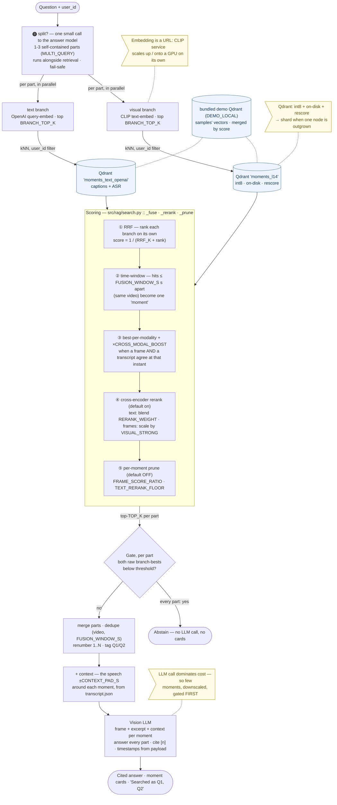

# Architecture — deep dive

The high-level shape (the write/read split, the mermaid overview, one image with four entrypoints) is in the [README](README.md#architecture). This document holds the internals: the pipeline stage tables, how the demo corpus ships pre-indexed, how a question is split and its retrieval scores fused, how Qdrant is run at frame scale, why embedding is a separate service, how the queue stays fair, and the repo layout. The HTTP surface itself, endpoint by endpoint, is in [API.md](API.md).

---

## Write path — upload to searchable vectors

1. **Presign** — `POST /api/videos/presign {filename, content_type, size, sha256?}`. The server picks the key (`{user}/{video}/source.{ext}` — never trusted from the client), caps size and type, and returns a time-limited PUT URL. With `sha256` set, content the user already has indexed short-circuits to `{"mode": "exists"}`: no upload, no re-embed, the existing video is simply linked. Local storage can't mint URLs, so it answers `{"mode": "direct"}` and the API accepts the bytes itself.
2. **Upload** — the browser PUTs the file straight to the bucket. Gigabytes never flow through the API.
3. **Register** — `POST /api/videos {video_id, key}` for an upload, or `{url}` for YouTube, plus optional `session_id` and `speaker_recognition`. The API HEAD-verifies the object, writes a `pending` row, hands it to the dispatcher and returns `202`. It refuses up front (`503`, naming the env keys) when the stack can't ingest at all, so nothing sits `pending` forever.
4. **Worker** — up to `DISPATCH_MAX_INFLIGHT` videos at a time, admitted by the fair dispatcher (below). Status moves `pending → queued → fetching → sampling → embedding → indexed`, or ends `failed` (with `error`) or `skipped` (a duplicate). One Prefect flow, four tasks (dedup runs inside `sample`):

| Stage | What happens |
|---|---|
| **fetch** | an upload streams from the bucket and is `sha256`-hashed. A YouTube video comes from the **SocialKit** download API when `SOCIALKIT_API_KEY` is set, else from **yt-dlp** (with cookies or a proxy if configured); its YouTube id is its content identity. A duplicate `(user_id, source_hash)` marks the row `skipped`, links the original into the session instead, and stops. |
| **sample** | one ffmpeg pass decodes, samples (interval or scene-cut), downscales and pipes JPEGs to memory. **The biggest scaling lever** — sampling is what stops thousands of videos becoming billions of near-identical vectors. |
| **dedup** | perceptual hash (dHash + luminance) drops visually-identical neighbours *before* they cost CLIP compute. Thumbnails batch-upload to `{user}/{video}/frames/NNNNNN.jpg`. |
| **embed + index** | batches of `CLIP_BATCH` frames go to the warm CLIP service, then upsert to `moments_l14` with deterministic IDs (`uuid5(video_id:frame_idx)` — re-runs overwrite, never duplicate). |
| **transcript** | cues come from SocialKit's transcript API or yt-dlp captions for YouTube, and from ASR (`ASR_PROVIDER`, default OpenAI Whisper) for uploads. With speaker recognition on, Gemini labels who said each cue. Cues are grouped into ~`TRANSCRIPT_CHUNK_SECONDS` (20s) passages that also break on a speaker change, stored durably as `{user}/{video}/transcript.json`, text-embedded and upserted to `moments_text_openai`. Best-effort: no captions, no speech, or any error leaves the video visual-only, sets a `transcript_note` the UI shows, and never fails the run. |

Poll `GET /api/videos` until `indexed`.

### Import from Google Drive (optional)

The workspace has an **Import from Google Drive** button; it starts working once `GDRIVE_CLIENT_ID` + `GDRIVE_API_KEY` are set (until then a click names the two missing variables). It's deliberately *client-side* and adds no endpoint, no source type and no stored credential: the user consents in Google's popup, picks in Google's file browser, and the page downloads the file and feeds it to the ordinary upload path above. Google's scripts load on first click, so a deployment that never sets these keys never talks to Google.

Two decisions worth keeping if you extend this:

- **Scope is `drive.file`** — the picked files only. Broad `drive.readonly` would trigger Google app verification plus an annual third-party security assessment, and would mean holding a token to someone's entire Drive in an app that has no sign-in. Reaching the port must not mean reading a Drive.
- **The browser moves the bytes**, Drive → tab → bucket. It costs a round trip through the user's connection, and buys away the whole server-side problem: no refresh-token storage, no rotation races between workers, no token expiring while the video waits in the queue. Server-side fetch is the upgrade *if* transfer speed is the complaint — it should wait for real auth.

---

## The demo corpus — shipped, not indexed

Ten 3Blue1Brown videos ([src/samples.py](src/samples.py)) are the demo, and the first thing a fresh clone can ask about. They were indexed **once, offline**, by [src/build_demo_corpus.py](src/build_demo_corpus.py) running the real pipeline, and the result ships in `demo_corpus/`:

| Path | Holds |
|---|---|
| `demo_corpus/vectors/<collection>.npz` | ids, float32 vectors and payloads for both collections (~7MB; exact, so a restored collection ranks identically to the original) |
| `demo_corpus/objects/` | each video's frame JPEGs and `transcript.json` (~25MB) |
| `demo_corpus/videos.json` | the ten `ms_videos` rows as plain, diffable JSON |
| `demo_corpus/qdrant/` | Qdrant's own storage tree, rebuilt locally from the npz on first boot (git-ignored: ~1GB of preallocated segments for 7MB of numbers) |

The **startup gate** ([src/seed.py](src/seed.py)) runs before `api`/`worker`. `SEED_MODE=restore` — the default whenever the corpus is on disk — has [src/demo_restore.py](src/demo_restore.py) insert the rows, load the vectors into the bundled Qdrant if it is empty, verify all three stores hold exactly these ten ids, and exit: seconds, no YouTube, no CLIP download, no keys. `SEED_MODE=ingest` is the old behaviour: [src/seeding.py](src/seeding.py) indexes the samples live into your own stores, about 45 minutes for all ten.

At **runtime**, `DEMO_LOCAL=true` (default) keeps the samples where they shipped, whatever `QDRANT_URL` and `STORAGE_PROVIDER` say: their vectors are read from the bundled Qdrant at `DEMO_QDRANT_URL` and their frames and transcripts from `DEMO_STORAGE_DIR`. So a user can point their own uploads at Qdrant Cloud and a GCS bucket and still have a working demo with nothing indexed and nothing to pay for. Two consequences in the code:

- **Two vector stores, one ranking.** When the demo store differs from the user's (`vector_store.demo_split()`), each branch queries both and merges by score — same model, same metric, so the global top-k is what a single store would have returned. Every point-level call routes by video id (`vector_store.client_for`).
- **Sample keys are always on disk.** `storage._root(key)` sends a sample's `{user}/{video}/…` keys to `demo_corpus/objects` and refuses to presign them, so the API serves those frames itself even on a bucket deployment.

The one exception is the manifest: sample **rows** are replayed into `DATABASE_URL`, because sessions join videos to chats with a foreign key, and a row in another database can't be joined to. `DEMO_LOCAL=false` folds the samples back into your own stores like any other video (they are then ingested or imported there).

---

## Read path — question to answer-or-abstain

`POST /api/ask {question, video_ids?, top_k?}`, or the session-scoped twin. Everything below lives in [src/rag/search.py](src/rag/search.py) unless another file is named.

**0 · Split — one question, or several?** A multi-part question ("what figures does Cleo cite, and how does Mark answer them?") is two retrievals, not one: a single embedding of the whole sentence lands between the topics and finds neither well. One small call to the *same* model that writes the answer ([src/rag/query_split.py](src/rag/query_split.py)) returns self-contained sub-questions, at most `MULTI_QUERY_MAX_PARTS` (3). It splits only when the parts need evidence from *different places* — different speakers, videos, or moments far apart in time; a two-clause question about one moment stays whole. A regex pre-check skips the call for questions with no "and", comma or similar, and any failure or odd reply falls back to the original question.

> **It costs no wall-clock on a single question.** The split check and the model lookup (a DB round trip) run *alongside* the plain retrieval, not before it. Only a real split triggers more work: each part is then retrieved in parallel.

**1 · Retrieve — both branches, in parallel, always.** No query router: routing fails exactly on the ambiguous questions where you need help most.

> **In plain words:** search your videos **two ways at once** — by *what's on screen* (the frames) and by *what's said* (the transcript) — and grab the top matches from each. Retrieval is cheap, so cast a wide net here.

- **visual** — text-embed the question into the *frame* space → Qdrant `moments_l14`, filtered by `user_id`, quantization-rescored, top `BRANCH_TOP_K` (20).
- **text** — query-embed → `moments_text_openai` (captions + ASR), top `BRANCH_TOP_K`. Skipped cleanly when `ENABLE_TRANSCRIPT=false` or nothing is indexed.
- With `DEMO_LOCAL` splitting the stores, each branch queries the user's Qdrant and the bundled one and merges by score.
- A split question runs this once **per part, in parallel**, sharing `MULTI_QUERY_TOTAL_K` (12) moments out across the parts (6+6, or 4+4+4).

**2 · Score — the fusion module** (`_fuse`, `_rerank`, `_prune`). The branches' raw scores are incomparable (CLIP ~0.3 vs text ~0.5-0.7), so we never sort by raw score:

> **In plain words:** the two searches score on different scales, so we can't just compare numbers. We **rank** each list, **merge** them fairly, **join** hits at the same moment into one, **boost** moments where picture *and* words agree, then a **reranker re-reads** the top transcript matches to reorder by true relevance.

| Step | What it does |
|---|---|
| **RRF** | rank each branch on its own, score by rank `1/(RRF_K + rank)` — a strong frame and a strong transcript hit compete fairly |
| **time-window** | hits within `FUSION_WINDOW_S` seconds of the same video collapse into one *moment*; the timestamp is the join key. Only the **best** hit per modality counts, so a burst of near-identical frames can't inflate a window |
| **cross-modal boost** | a moment where **both** a frame and a transcript chunk land at the same instant is ×`CROSS_MODAL_BOOST` — two independent modalities agreeing is the strongest signal available |
| **cross-encoder rerank** | a local, keyless reranker re-reads the top text candidates and blends with the normalized RRF (`RERANK_WEIGHT`). Frame-only moments (no transcript) are then scaled by **how strong their raw visual match is** (`VISUAL_STRONG`): a weak talking-head frame sinks below a clearly-relevant transcript, while a real slide/diagram still ranks. **On by default**; `ENABLE_RERANK=false` = plain RRF |
| **per-moment prune** | `FRAME_SCORE_RATIO` (drop frame-only moments under a share of the best frame) and `TEXT_RERANK_FLOOR` (drop transcript moments the reranker scored under a floor). **Both default off**: measured on the 42-question set, CLIP's compressed scores meant the ratio never fired, and the default MiniLM reranker scores correct transcript moments near 0, so a floor removed right answers. The ranking uses the reranker's *order*, which is sound; its absolute value is not a quality signal. See `config.py` |

The top `TOP_K` (6) moments go forward. For a split question each part is gated on its own (step 3), then the parts' moments are merged, deduped by video and `FUSION_WINDOW_S` (a moment two parts both found appears once, tagged with both), and renumbered 1..N so the `[n]` the model cites is the card the user sees.

**3 · Gate — confidence.** Checked on the *raw per-branch bests* (RRF scores are far too small to threshold on). Abstain only when **neither** what's on screen (`CONFIDENCE_THRESHOLD`) **nor** what's said (`TEXT_CONFIDENCE_THRESHOLD`) clears its bar — "I couldn't find that in your videos", **no LLM call**, and no cards. Kills most hallucination risk for free. A part that fails the gate is dropped and the model is told to say so in one line; only when every part fails does the whole question abstain.

**4 · Generate.** Each moment's frame (downscaled to `LLM_IMAGE_MAX_PX`), its transcript excerpt, **and the speech around it** go to the vision LLM. The context is `CONTEXT_PAD_S` (10s) either side of the matched span — the chunk before and after a transcript hit, the words spoken over a frame — read from the durable `transcript.json` in the same thread pool that fetches the frames, so it adds no round trip. The prompt ([src/providers/llm/base.py](src/providers/llm/base.py)) tells the model to answer only from the moments, cover every part, use the facts that are there, cite `[n]`, attribute by name only where a moment carries a speaker tag, and add a "Who said what" table when two or more named speakers appear. Citations are validated; invented references are stripped; a reply that cites nothing hides the cards.

**5 · Answer.** Clickable thumbnails + timestamps, read from the winning hit's payload — the LLM never invents a timestamp. A split question also returns `parts`, shown as "Searched as Q1 … Q2 …" with a Q-tag on each card.

**Watching it happen.** `POST /api/ask_stream` and `POST /api/sessions/{id}/ask_stream` report each stage over Server-Sent Events as it *begins* — `embedding → searching → ranking → [splitting → parts] → reading → answering`, the bracketed two only when the split check outlasts retrieval and when the question was actually split. The events come from real pipeline boundaries (`on_stage`), not a timer, so a slow stage visibly sits there instead of a progress bar lying to you. It doubles as a profiler. Measured on the 42-question set with gpt-4.1-mini: a single-part question lands in about **5-8s** and a multi-part one in **10-11s** — retrieval ~2s warm (embedding ~0.1s, the two Qdrant queries, the reranker ~1s, one Postgres lookup), the split hidden behind it, parallel part-retrievals ~2.5s, frames + context under 1s, the answer call 3-5s. The first question after a restart is ~20s slower while clients and the reranker warm up.

The cost fact that drives the whole shape: retrieval is a couple of seconds and metered by nobody; the multimodal LLM call is the only paid step and the slowest. Optimize there — few moments, downscaled, gated first, everything else overlapped — not the vector store.

### The read path in detail



Retrieval is seconds and unmetered, the multimodal LLM call is seconds and paid, so the funnel spends its cheap budget widely (both branches, every part, always) and its expensive budget narrowly (a handful of gated, downscaled moments, once). Each box scales on its own bottleneck — that's the point of splitting the processes out:

| Component | Scales by | Bottleneck | How |
|---|---|---|---|
| **API** ([src/app.py](src/app.py)) | replicas | request concurrency (all I/O) | stateless; auto-stops when idle on Fly |
| **Worker** ([src/worker.py](src/worker.py)) | replicas | ingest throughput — download + ffmpeg | `fly scale count worker=N` / `--scale worker=N`; workers only dial out, zero coordination |
| **Embedding service** ([src/clip_service.py](src/clip_service.py)) | vertically → **GPU** | embedding FLOPs | one warm model behind `EMBED_SERVICE_URL`; move it to a GPU box, change only the URL. Skipped entirely for hosted embedders |
| **Startup gate** ([src/seed.py](src/seed.py)) | one-shot | — | restores `demo_corpus/` (or indexes the samples), then exits; `api`/`worker` wait on it |
| **Qdrant** | memory profile → shards | vector count | int8 + on-disk + rescore by default; shard when one node is outgrown |

The two axes pull in opposite directions: **ingest** wants many cheap CPU workers (scale out), **embedding** wants one hot model (scale up / GPU). The naive "CLIP inside the worker" couples them and forces you to pay for GPUs on every worker or starve embedding on every scale-out.

---

## Qdrant at frame scale

One shared collection per branch, multi-tenant by `user_id` (tenant payload index) — not collection-per-user. With `DEMO_LOCAL` the ten samples sit in a second, bundled Qdrant (see [The demo corpus](#the-demo-corpus--shipped-not-indexed)); the user's own videos never do. Frames balloon vector counts fast (a 1h video at 2s sampling ≈ 1,800 candidate frames), so the low-RAM profile defaults **on**:

| Flag | Effect | Default |
|---|---|---|
| `QDRANT_ON_DISK` | original float vectors on disk | on |
| `QDRANT_QUANTIZATION` | int8 copies pinned in RAM (~4× smaller) do the search; queries rescore from the originals | on |
| `QDRANT_HNSW_ON_DISK` | the HNSW graph on disk too | on |

For intuition: 200M frame vectors ≈ 600GB float32 vs ≈ 150GB int8. On a big-RAM node flip these off to trade memory back for speed. Payloads are trimmed to filter/display fields; titles and URLs live in Postgres and join at answer time. `embed_version` on every point means a future CLIP upgrade can re-embed in the background without breaking the live index.

## "Embedding is a URL"

Local inference runs in a dedicated service ([clip_service.py](src/clip_service.py)): one warm model loaded at boot, api + workers send batches over HTTP (`EMBED_SERVICE_URL`). That's what makes workers cheap and stateless — no torch, no ~15-30s model reload per video. Scaling embedding = scaling that one service: CPU container today, the same container on a GPU machine later, with nothing but the URL changing. **Unset the URL and everything embeds in-process** — the zero-service simple mode.

Choosing a hosted embedder is the third option: the API and workers call the provider directly, so there's nothing to warm and the service URL is ignored. You've swapped a compute-scaling problem for a cost-per-frame one.

## Fair scheduling (WFQ)

The queue is fair, not FIFO. Enqueueing every video to Prefect at register time would run them in submitted order — one user who uploads 50 videos blocks everyone behind them. Instead videos wait `pending` in Postgres and a **dispatcher** ([src/dispatcher.py](src/dispatcher.py)) admits them **round-robin across users**, keeping only `DISPATCH_MAX_INFLIGHT` running.

```
FIFO:  user A ▓▓▓▓▓▓▓▓▓▓ (50)  then→  user B ▓   ← B waits for all of A
WFQ:   A▓ B▓ A▓ B▓ A▓ B▓ …            ← interleaved; B is served immediately
```

`ENABLE_FAIR_DISPATCH=false` falls back to plain FIFO if you want to see the difference. `DISPATCH_MAX_INFLIGHT` should equal your real capacity (`worker machines × WORKER_CONCURRENCY`); anything above just piles up FIFO inside Prefect and defeats the fairness.

**Deletes purge everything** — `DELETE /api/videos/{id}` removes the vectors (by filter), the thumbnails + raw upload (batch delete), and the manifest row. Deleting a session purges the videos no other session still holds. Samples are refused.

**Later, under real load** (design room exists, not built): per-tenant quotas and weights, backpressure on queue depth, a Redis query cache, a stronger reranker (the single biggest retrieval lever left — the answer chunk is usually inside the top 30 candidates), and OCR / on-screen text as a third branch so questions about code or slides on screen stop depending on CLIP, which cannot read.

---

## Repo layout

Repo root holds only build/config/docs; **all Python lives under `src/`**.

```
├── Dockerfile               the app image (api/worker/seed/clip); WITH_TORCH arg = fat (default) or slim
├── Dockerfile.clip          the CLIP service image (CPU default; TORCH_INDEX_URL build-arg for a GPU host)
├── docker-compose.yml       local dev: qdrant (demo corpus) + clip + seed + api + worker (+ optional local-postgres)
├── fly.toml                 Fly.io: FAT api/worker/clip process groups + seed release_command
├── fly.slim.toml            Fly.io: SLIM api+worker, CLIP on an external host
├── requirements.txt         base deps (no torch)
├── requirements-clip.txt    the local-CLIP torch stack (fat image + Dockerfile.clip)
├── demo_corpus/             the demo, shipped: ten videos' vectors (npz), frames + transcripts, rows
├── .env.example             full reference — every knob, documented inline
├── .env.local.example       ready-to-copy LOCAL preset (local storage + Qdrant + Postgres)
├── README.md · API.md · ARCHITECTURE.md · MODELS.md · DEPLOYMENT.md   the docs (this file is the internals)
├── ui/                      static pages + JS modules, no build step
│   ├── landing.html         entry page
│   ├── demo.html            read-only demo UI (slider + browse over the ten videos)
│   ├── app.html             the workspace: add → process → ask
│   ├── app.css              shared styles
│   ├── common.js            shared helpers: moment cards, Q-tags, the player modal
│   ├── demo.js              demo-page logic: corpus slider, browse drawer, streaming ask
│   ├── workspace.js         upload / pipeline / streaming ask / player
│   └── assets/              logo marks
├── examples/quickstart.py   manual in-process seed + terminal query demo
├── benchmark/               an older question set (its videos are no longer the shipped demo)
└── src/                     ── entrypoints ──────────────────────────────────
    ├── app.py               unified FastAPI app — four routers, one port, /ui static
    ├── worker.py            Prefect worker — serves "ms-ingest-video/ingest" + runs the dispatcher
    ├── clip_service.py      embedding service — warm local models behind a URL
    ├── seed.py              startup gate — SEED_MODE=restore (demo_corpus/) or ingest, then exits
    │                        ── core ──────────────────────────────────────────
    ├── config.py            every env knob in one place
    ├── db.py                Postgres: manifest + status + sessions + chat
    ├── jobs.py              Prefect Cloud trigger
    ├── storage.py           object storage (aws|gcp|gcp_native|flyio|local) + presigning; routes sample keys to demo_corpus/
    ├── setup_check.py       what this instance is still missing — one truth for the boot log, /api/config and the register guard
    ├── preflight.py         deploy sanity check — warns when a LOCAL setting ships to prod
    ├── samples.py           which ten videos the demo holds (+ author credit)
    ├── demo_restore.py      loads demo_corpus/ into place — the default gate
    ├── demo_corpus_io.py    the corpus's vectors as npz — export on build, import on first boot
    ├── build_demo_corpus.py rebuilds demo_corpus/ with the real pipeline (run by hand, rarely)
    ├── seeding.py           blocking seed-to-completion logic (SEED_MODE=ingest)
    ├── dispatcher.py        WFQ: fair round-robin admission of pending videos
    ├── llm.py               back-compat shim → src/providers/llm
    ├── api/                 ── HTTP routers (see API.md) ─────────────────────
    │   ├── videos.py        presign / register / status / retry / delete + require_auth()
    │   ├── sessions.py      sessions, membership, ask, ask_stream (SSE stages)
    │   ├── search.py        /api/ask + ask_stream, /api/config, /api/llm, transcript, frames, pages
    │   └── auth.py          the one account — GET /api/auth/me
    ├── providers/           ── pluggable models ──────────────────────────────
    │   ├── registry.py      the provider table: endpoints, models, dims, keys
    │   ├── status.py        configured/installed/missing — GET /api/providers
    │   ├── __main__.py      `python -m src.providers` model doctor (+ --live)
    │   ├── llm/             answer synthesis: base.py (prompt, config), one module per wire dialect
    │   └── embed/           retrieval embeddings, both branches (clip_local, fastembed, openai, gemini, cohere, voyage, jina, remote)
    ├── ingest/
    │   ├── fetch.py         source acquisition (bucket | SocialKit | yt-dlp) + sha256
    │   ├── socialkit.py     SocialKit API: YouTube transcript + video download by key
    │   ├── frames.py        ffmpeg pipe-to-memory sampling (interval | scene)
    │   ├── dedup.py         perceptual-hash dedup
    │   ├── transcript.py    YouTube captions → speaker-aware time-chunks
    │   ├── asr.py           ASR (Whisper) for uploaded videos
    │   ├── diarize.py       Gemini speaker labels — "who said what"
    │   └── pipeline.py      the Prefect flow: fetch → sample → embed/index → transcript
    └── rag/
        ├── query_split.py   multi-part questions → self-contained parts (one small LLM call, fail-safe)
        ├── rerank.py        cross-encoder reranker over the fused text moments
        ├── vector_store.py  multi-tenant Qdrant: visual + text collections, user store + bundled demo store
        ├── embeddings.py    back-compat shim → src/providers/embed
        └── search.py        split → 2-branch retrieve (per part) → RRF fusion → rerank → gate → context → cited answer
```
