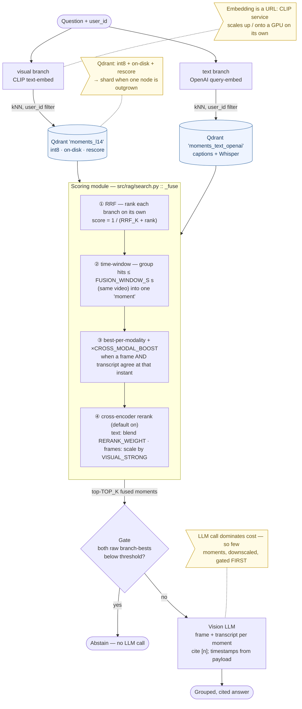

# Architecture — deep dive

The high-level shape (the write/read split, the mermaid overview, one image with four entrypoints) is in the [README](README.md#architecture). This document holds the internals: the full pipeline stage tables, how retrieval scores are fused, how Qdrant is run at frame scale, why embedding is a separate service, how the queue stays fair, and the repo layout.

---

## Write path — upload to searchable vectors

1. **Presign** — `POST /api/videos/presign {filename, content_type, size}`. The server picks the key (`{user}/{video}/source.{ext}` — never trusted from the client), caps size and type, returns a time-limited PUT URL.
2. **Upload** — the browser PUTs the file straight to the bucket. Gigabytes never flow through the API.
3. **Register** — `POST /api/videos {video_id, key}`. The API HEAD-verifies the object, writes a `pending` row, schedules a Prefect run, returns `202`.
4. **Worker** — `WORKER_CONCURRENCY` videos at a time:

| Stage | What happens |
|---|---|
| **fetch** | stream from the bucket (or yt-dlp for YouTube), `sha256` it. A duplicate `(user_id, source_hash)` marks the row `skipped` and stops. |
| **sample** | one ffmpeg pass decodes, samples (interval or scene-cut), downscales and pipes JPEGs to memory. **The biggest scaling lever** — sampling is what stops thousands of videos becoming billions of near-identical vectors. |
| **dedup** | perceptual hash (dHash + luminance) drops visually-identical neighbours *before* they cost CLIP compute. Thumbnails batch-upload to `{user}/{video}/frames/NNNNNN.jpg`. |
| **embed + index** | batches of `CLIP_BATCH` frames go to the warm CLIP service, then upsert to `moments_l14` with deterministic IDs (`uuid5(video_id:frame_idx)` — re-runs overwrite, never duplicate). |
| **transcript** | YouTube uses captions; uploads are transcribed by **Whisper** from their own audio. Cues land in the durable `{user}/{video}/transcript.json`, then → ~20s chunks → text embeddings → `moments_text_openai`. Best-effort: a caption-less YouTube video with no usable audio stays visual-only and the run never fails. |

Poll `GET /api/videos` until `indexed`.

### Import from Google Drive (optional)

The workspace has an **Import from Google Drive** button; it starts working once `GDRIVE_CLIENT_ID` + `GDRIVE_API_KEY` are set (until then a click names the two missing variables). It's deliberately *client-side* and adds no endpoint, no source type and no stored credential: the user consents in Google's popup, picks in Google's file browser, and the page downloads the file and feeds it to the ordinary upload path above. Google's scripts load on first click, so a deployment that never sets these keys never talks to Google.

Two decisions worth keeping if you extend this:

- **Scope is `drive.file`** — the picked files only. Broad `drive.readonly` would trigger Google app verification plus an annual third-party security assessment, and would mean holding a token to someone's entire Drive in an app that has no sign-in. Reaching the port must not mean reading a Drive.
- **The browser moves the bytes**, Drive → tab → bucket. It costs a round trip through the user's connection, and buys away the whole server-side problem: no refresh-token storage, no rotation races between workers, no token expiring while the video waits in the queue. Server-side fetch is the upgrade *if* transfer speed is the complaint — it should wait for real auth.

---

## Read path — question to answer-or-abstain

`POST /api/ask {question, video_id?}`

**1 · Retrieve — both branches, in parallel, always.** No query router: routing fails exactly on the ambiguous questions where you need help most.

> **In plain words:** search your videos **two ways at once** — by *what's on screen* (the frames) and by *what's said* (the transcript) — and grab the top matches from each. Retrieval is cheap, so cast a wide net here.

- **visual** — text-embed the question into the *frame* space → Qdrant `moments_l14`, filtered by `user_id`, quantization-rescored. Milliseconds.
- **text** — query-embed → `moments_text_openai` (captions + Whisper). Skipped cleanly when `ENABLE_TRANSCRIPT=false` or nothing is indexed.

**2 · Score — the fusion module** (`_fuse`, [src/rag/search.py](src/rag/search.py)). The branches' raw scores are incomparable (CLIP ~0.3 vs text ~0.7), so we never sort by raw score:

> **In plain words:** the two searches score on different scales, so we can't just compare numbers. We **rank** each list, **merge** them fairly, **join** hits at the same moment into one, **boost** moments where picture *and* words agree, then a **reranker re-reads** the top transcript matches to reorder by true relevance.

| Step | What it does |
|---|---|
| **RRF** | rank each branch on its own, score by rank `1/(RRF_K + rank)` — a strong frame and a strong transcript hit compete fairly |
| **time-window** | hits within `FUSION_WINDOW_S` seconds of the same video collapse into one *moment*; the timestamp is the join key |
| **cross-modal boost** | a moment where **both** a frame and a transcript chunk land at the same instant is ×`CROSS_MODAL_BOOST` — two independent modalities agreeing is the strongest signal available |
| **cross-encoder rerank** | a local, keyless reranker re-reads the top text candidates and blends with the normalized RRF (`RERANK_WEIGHT`). Frame-only moments (no transcript) are then scaled by **how strong their raw visual match is** (`VISUAL_STRONG`): a weak talking-head frame sinks below a clearly-relevant transcript, while a real slide/diagram still ranks. **On by default**; `ENABLE_RERANK=false` = plain RRF |

The top `TOP_K` fused moments go forward.

**3 · Gate — confidence.** Checked on the *raw per-branch bests* (RRF scores are far too small to threshold on). Abstain only when **neither** what's on screen (`CONFIDENCE_THRESHOLD`) **nor** what's said (`TEXT_CONFIDENCE_THRESHOLD`) clears its bar — "I couldn't find that in your videos", **no LLM call**. Kills most hallucination risk for free.

**4 · Generate.** Each moment's frame (downscaled to `LLM_IMAGE_MAX_PX`) and its transcript excerpt go to the vision LLM: answer only from these moments, cite `[n]`, or say so. Citations are validated; invented references are stripped.

**5 · Answer.** Clickable thumbnails + timestamps, read from the winning hit's payload — the LLM never invents a timestamp.

**Watching it happen.** `POST /api/sessions/{id}/ask_stream` reports each stage over Server-Sent Events as it *begins* — `embedding → searching → ranking → reading → answering`. The events come from real pipeline boundaries (`on_stage` in [src/rag/search.py](src/rag/search.py)), not a timer, so a slow stage visibly sits there instead of a progress bar lying to you. It doubles as a profiler: a warm question is roughly *embedding 50ms · Qdrant 350ms · rerank ~1s · frame fetches ~1s · LLM 5-7s*.

The cost fact that drives the whole shape: retrieval is ~10-30ms, the multimodal LLM call is seconds. Optimize there — few moments, downscaled, gated — not the vector store.

### The read path in detail



Retrieval is milliseconds and the multimodal LLM call is seconds, so the funnel spends its cheap budget widely (both branches, always) and its expensive budget narrowly (a handful of gated, downscaled moments). Each box scales on its own bottleneck — that's the point of splitting the processes out:

| Component | Scales by | Bottleneck | How |
|---|---|---|---|
| **API** ([src/app.py](src/app.py)) | replicas | request concurrency (all I/O) | stateless; auto-stops when idle on Fly |
| **Worker** ([src/worker.py](src/worker.py)) | replicas | ingest throughput — download + ffmpeg | `fly scale count worker=N` / `--scale worker=N`; workers only dial out, zero coordination |
| **Embedding service** ([src/clip_service.py](src/clip_service.py)) | vertically → **GPU** | embedding FLOPs | one warm model behind `EMBED_SERVICE_URL`; move it to a GPU box, change only the URL. Skipped entirely for hosted embedders |
| **Qdrant** | memory profile → shards | vector count | int8 + on-disk + rescore by default; shard when one node is outgrown |

The two axes pull in opposite directions: **ingest** wants many cheap CPU workers (scale out), **embedding** wants one hot model (scale up / GPU). The naive "CLIP inside the worker" couples them and forces you to pay for GPUs on every worker or starve embedding on every scale-out.

---

## Qdrant at frame scale

One shared collection, multi-tenant by `user_id` (tenant payload index) — not collection-per-user. Frames balloon vector counts fast (a 1h video at 2s sampling ≈ 1,800 candidate frames), so the low-RAM profile defaults **on**:

| Flag | Effect | Default |
|---|---|---|
| `QDRANT_ON_DISK` | original float vectors on disk | on |
| `QDRANT_QUANTIZATION` | int8 copies pinned in RAM (~4× smaller) do the search; queries rescore from the originals | on |
| `QDRANT_HNSW_ON_DISK` | the HNSW graph on disk too | on |

For intuition: 200M frame vectors ≈ 600GB float32 vs ≈ 150GB int8. On a big-RAM node flip these off to trade memory back for speed. Payloads are trimmed to filter/display fields; titles and URLs live in Postgres and join at answer time. `embed_version` on every point means a future CLIP upgrade can re-embed in the background without breaking the live index.

## "Embedding is a URL"

Local inference runs in a dedicated service ([clip_service.py](src/clip_service.py)): one warm model loaded at boot, api + workers send batches over HTTP (`EMBED_SERVICE_URL`). That's what makes workers cheap and stateless — no torch, no ~15-30s model reload per video. Scaling embedding = scaling that one service: CPU container today, the same container on a GPU machine later, with nothing but the URL changing. **Unset the URL and everything embeds in-process** — the zero-service simple mode.

Choosing a hosted embedder is the third option: the API and workers call the provider directly, so there's nothing to warm and the service URL is ignored. You've swapped a compute-scaling problem for a cost-per-frame one.

## Fair scheduling (WFQ)

The queue is fair, not FIFO. Enqueueing every video to Prefect at register time would run them in submitted order — one user who uploads 50 videos blocks everyone behind them. Instead videos wait `pending` in Postgres and a **dispatcher** ([src/dispatcher.py](src/dispatcher.py)) admits them **round-robin across users**, keeping only `DISPATCH_MAX_INFLIGHT` running.

```
FIFO:  user A ▓▓▓▓▓▓▓▓▓▓ (50)  then→  user B ▓   ← B waits for all of A
WFQ:   A▓ B▓ A▓ B▓ A▓ B▓ …            ← interleaved; B is served immediately
```

`ENABLE_FAIR_DISPATCH=false` falls back to plain FIFO if you want to see the difference. `DISPATCH_MAX_INFLIGHT` should equal your real capacity (`worker machines × WORKER_CONCURRENCY`); anything above just piles up FIFO inside Prefect and defeats the fairness.

**Deletes purge everything** — `DELETE /api/videos/{id}` removes the vectors (by filter), the thumbnails + raw upload (batch delete), and the manifest row.

**Later, under real load** (design room exists, not built): per-tenant quotas and weights, backpressure on queue depth, a Redis query cache, and OCR / on-screen-text as a third branch.

---

## Repo layout

Repo root holds only build/config/docs; **all Python lives under `src/`**.

```
├── Dockerfile               the app image (api/worker/seed/clip); WITH_TORCH arg = fat (default) or slim
├── Dockerfile.clip          the CLIP service image (CPU default; TORCH_INDEX_URL build-arg for a GPU host)
├── docker-compose.yml       local dev: clip + seed + api + worker (+ optional local-qdrant / local-postgres)
├── fly.toml                 Fly.io: FAT api/worker/clip process groups + seed release_command
├── fly.slim.toml            Fly.io: SLIM api+worker, CLIP on an external host
├── requirements.txt         base deps (no torch)
├── requirements-clip.txt    the local-CLIP torch stack (fat image + Dockerfile.clip)
├── .env.example             full reference — every knob, documented inline
├── .env.local.example       ready-to-copy LOCAL preset (local storage + Qdrant + Postgres + keyless models)
├── ui/                      static pages + JS modules, no build step
│   ├── landing.html         entry page
│   ├── demo.html            read-only sample UI
│   ├── app.html             the workspace: add → process → ask
│   ├── app.css              shared styles
│   ├── common.js            shared helpers
│   ├── demo.js              sample-project logic
│   └── workspace.js         upload / pipeline / streaming ask / player
├── examples/quickstart.py   manual in-process seed + terminal query demo
└── src/                     ── entrypoints ──────────────────────────────────
    ├── app.py               unified FastAPI app — videos + search routers, one port
    ├── worker.py            Prefect worker — serves "ms-ingest-video/ingest"
    ├── clip_service.py      embedding service — warm local models behind a URL
    ├── seed.py              startup gate — indexes the sample, then exits
    │                        ── core ──────────────────────────────────────────
    ├── config.py            every env knob in one place
    ├── db.py                Postgres: manifest + status + sessions + chat
    ├── jobs.py              Prefect Cloud trigger
    ├── storage.py           object storage (aws|gcp|gcp_native|flyio|local) + presigning
    ├── preflight.py         deploy sanity check — warns when a LOCAL setting ships to prod
    ├── samples.py           the sample corpus
    ├── seeding.py           blocking seed-to-completion logic
    ├── dispatcher.py        WFQ: fair round-robin admission of pending videos
    ├── api/                 ── HTTP routers ──────────────────────────────────
    │   ├── videos.py        presign / register / status / retry / delete + require_auth()
    │   ├── sessions.py      sessions, membership, ask, ask_stream (SSE stages)
    │   ├── search.py        /api/ask, /api/config, /api/llm, frames, transcript, pages
    │   └── auth.py          the one account — GET /api/auth/me
    ├── providers/           ── pluggable models ──────────────────────────────
    │   ├── registry.py      the provider table: endpoints, models, dims, keys
    │   ├── status.py        configured/installed/missing — GET /api/providers
    │   ├── __main__.py      `python -m src.providers` model doctor (+ --live)
    │   ├── llm/             answer synthesis, one module per wire dialect
    │   └── embed/           retrieval embeddings, both branches
    ├── ingest/
    │   ├── fetch.py         source acquisition (bucket | yt-dlp) + sha256
    │   ├── frames.py        ffmpeg pipe-to-memory sampling (interval | scene)
    │   ├── dedup.py         perceptual-hash dedup
    │   ├── transcript.py    YouTube captions → time-chunks
    │   ├── asr.py           Whisper ASR for uploaded videos
    │   ├── diarize.py       Gemini speaker labels — "who said what"
    │   └── pipeline.py      the Prefect flow: fetch → sample → embed/index → transcript
    └── rag/
        ├── rerank.py        cross-encoder reranker over the fused moments
        ├── vector_store.py  multi-tenant Qdrant: visual + text collections
        └── search.py        2-branch retrieve → RRF fusion → rerank → gate → cited answer
```
