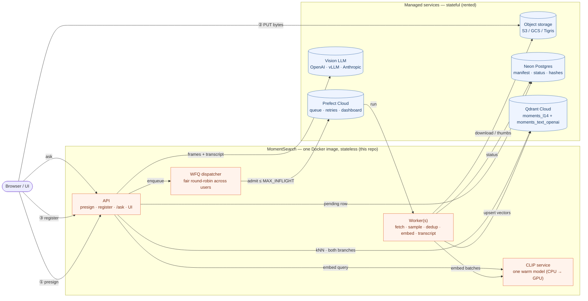

# MomentSearch

**Ask questions about your videos. Get answers grounded in the exact moment — matched on what's _seen_ on screen and what's _said_ in the transcript.**

🌐 **Live app:** [momentsearch.fly.dev](https://momentsearch.fly.dev/) · Apache 2.0

Upload videos or paste YouTube URLs. Background workers sample keyframes, dedup
them, embed them and index them in [Qdrant](https://qdrant.tech). Ask a
question, and it retrieves the best-matching moments and has a vision LLM read
those frames and write a cited answer — or abstain when the evidence isn't
there.

Every model is **pluggable by name**: the answer LLM and both embedding
branches. Run it fully local and keyless, fully hosted, or any mix.

---

# Setup

```bash
git clone https://github.com/traversaal-ai/momentsearch.git
cd momentsearch
cp .env.local.example .env      # local & keyless preset
docker compose up --build
# → http://localhost:8000
```

`.env.local.example` keeps storage, Qdrant, Postgres and the models **on your
machine**. One thing is left to fill in:

| Fill in | Get it from | Why |
|---|---|---|
| `PREFECT_API_URL` + `PREFECT_API_KEY` | [app.prefect.cloud](https://app.prefect.cloud) → avatar → API Keys (free, no card) | the ingest queue between the API and the workers |

First run takes a few minutes — model download plus indexing the sample video.
Watch it with `docker compose logs -f seed`. Later runs start in seconds.

**No LLM key?** Fine. Retrieval still works and you get ranked, clickable
moments instead of a written answer (the UI badge reads "No LLM — moments
only"). Add one when you want prose:

```bash
LLM_PROVIDER=openai
LLM_API_KEY=sk-...
```

## Deploying to the cloud instead

Use the full reference file — `cp .env.example .env` — and rent three things:

| `.env` key | Service | Free tier | Local alternative |
|---|---|---|---|
| `DATABASE_URL` | Postgres — the video manifest | [Neon](https://neon.tech) | `COMPOSE_PROFILES=local-postgres` + `DATABASE_URL=postgresql://ms:ms@postgres:5432/ms` |
| `PREFECT_API_URL` + `PREFECT_API_KEY` | the ingest queue | [Prefect Cloud](https://app.prefect.cloud) | a self-hosted `prefect server` |
| `QDRANT_URL` + `QDRANT_API_KEY` | the vector index | [Qdrant Cloud](https://cloud.qdrant.io) | `COMPOSE_PROFILES=local-qdrant` + `QDRANT_URL=http://qdrant:6333` |

> ⚠️ **A vector store is required.** A bare `cp .env.example .env && docker
> compose up` has no Qdrant, and both ingest and search fail. Point
> `QDRANT_URL` at Qdrant Cloud, or add the two `local-qdrant` lines above and
> compose starts one for you.

Object storage defaults to `STORAGE_PROVIDER=local` (files under `./data`, no
bucket, no keys). Switch to S3 / GCS / Tigris when you deploy — see
[Object storage](#object-storage).

## The three pages

| Page | What it is |
|---|---|
| **`/`** | Landing page. |
| **`/demo`** | The pre-indexed sample talk, read-only. Nothing is saved. |
| **`/app`** | The workspace: add videos → watch them index → ask. |

`/signin` and `/get-started` are `307` redirects to `/app`.

> ⚠️ **There is no authentication.** Opening the app *is* being logged in as
> the one account. Anyone who reaches the port can upload, ask and delete. Bind
> it to localhost or put an authenticating proxy in front. See
> [Security](#security).

## Without Docker

Four processes, each its own terminal:

```bash
uvicorn src.app:app --port 8000            # API + UI
python -m src.worker                       # ingest worker
uvicorn src.clip_service:app --port 8001   # CLIP service (optional — unset EMBED_SERVICE_URL to embed in-process)
python -m src.seed                         # one-shot: index the sample
```

## When something looks wrong

```bash
python -m src.providers          # what your .env actually resolved to, and what's missing
python -m src.providers --live   # actually call every configured model
```

This is the first thing to run when a key "isn't working". It names the env var
each key came from, flags provider-name typos (which silently resolve to a
fallback), and catches the most common misconfiguration: a leftover generic
`LLM_API_KEY` from another provider shadowing the provider-specific one.

---

# How it works

**The design rule: stateful = rented managed service, stateless = this repo.**
Every API box and worker is disposable; durable state lives in object storage,
Qdrant and Postgres.

Two paths that scale in opposite directions and never share a request — the
**write path** (slow, background; the API answers `202` instantly and workers do
the work) and the **read path** (fast; retrieval is milliseconds, the LLM call
dominates cost).



It's **one Docker image** with four entrypoints — the API, the ingest worker,
the CLIP service, and a one-shot seed gate. All Python lives under
[`src/`](src/); the repo root holds only build and config files.

| Piece | Where it runs | You… |
|---|---|---|
| API + worker + CLIP service (one image) | Fly.io / Docker / bare python | deploy it |
| Raw videos + thumbnails | S3 / GCS / Tigris (or `./data` in dev) | rent it |
| Postgres — manifest + status | [Neon](https://neon.tech) | rent it |
| Work queue + run dashboard | [Prefect Cloud](https://app.prefect.cloud) | rent it |
| Vector index | [Qdrant Cloud](https://cloud.qdrant.io) or local | rent it / self-host |
| Vision LLM | any provider — env-switched | rent it / self-host |

## Write path — upload to searchable vectors

1. **Presign** — `POST /api/videos/presign {filename, content_type, size}`. The
   server picks the key (`{user}/{video}/source.{ext}` — never trusted from the
   client), caps size and type, returns a time-limited PUT URL.
2. **Upload** — the browser PUTs the file straight to the bucket. Gigabytes
   never flow through the API.
3. **Register** — `POST /api/videos {video_id, key}`. The API HEAD-verifies the
   object, writes a `pending` row, schedules a Prefect run, returns `202`.
4. **Worker** — `WORKER_CONCURRENCY` videos at a time:

| Stage | What happens |
|---|---|
| **fetch** | stream from the bucket (or yt-dlp for YouTube), `sha256` it. A duplicate `(user_id, source_hash)` marks the row `skipped` and stops. |
| **sample** | one ffmpeg pass decodes, samples (interval or scene-cut), downscales and pipes JPEGs to memory. **The biggest scaling lever** — sampling is what stops thousands of videos becoming billions of near-identical vectors. |
| **dedup** | perceptual hash (dHash + luminance) drops visually-identical neighbours *before* they cost CLIP compute. Thumbnails batch-upload to `{user}/{video}/frames/NNNNNN.jpg`. |
| **embed + index** | batches of `CLIP_BATCH` frames go to the warm CLIP service, then upsert to `moments_l14` with deterministic IDs (`uuid5(video_id:frame_idx)` — re-runs overwrite, never duplicate). |
| **transcript** | YouTube uses captions; uploads are transcribed by **Whisper** from their own audio. Cues land in the durable `{user}/{video}/transcript.json`, then → ~20s chunks → text embeddings → `moments_text_openai`. Best-effort: a caption-less YouTube video with no usable audio stays visual-only and the run never fails. |

Poll `GET /api/videos` until `indexed`.

### Import from Google Drive (optional)

The workspace has an **Import from Google Drive** button; it starts working once
`GDRIVE_CLIENT_ID` + `GDRIVE_API_KEY` are set (until then a click names the two
missing variables). It's deliberately *client-side* and adds no
endpoint, no source type and no stored credential: the user consents in
Google's popup, picks in Google's file browser, and the page downloads the file
and feeds it to the ordinary upload path above. Google's scripts load on first
click, so a deployment that never sets these keys never talks to Google.

Two decisions worth keeping if you extend this:

- **Scope is `drive.file`** — the picked files only. Broad `drive.readonly`
  would trigger Google app verification plus an annual third-party security
  assessment, and would mean holding a token to someone's entire Drive in an app
  that has no sign-in. Reaching the port must not mean reading a Drive.
- **The browser moves the bytes**, Drive → tab → bucket. It costs a round trip
  through the user's connection, and buys away the whole server-side problem: no
  refresh-token storage, no rotation races between workers, no token expiring
  while the video waits in the queue. Server-side fetch is the upgrade *if*
  transfer speed is the complaint — it should wait for real auth.

## Read path — question to answer-or-abstain

`POST /api/ask {question, video_id?}`

**1 · Retrieve — both branches, in parallel, always.** No query router: routing
fails exactly on the ambiguous questions where you need help most.

- **visual** — text-embed the question into the *frame* space → Qdrant
  `moments_l14`, filtered by `user_id`, quantization-rescored. Milliseconds.
- **text** — query-embed → `moments_text_openai` (captions + Whisper). Skipped
  cleanly when `ENABLE_TRANSCRIPT=false` or nothing is indexed.

**2 · Score — the fusion module** (`_fuse`, [src/rag/search.py](src/rag/search.py)).
The branches' raw scores are incomparable (CLIP ~0.3 vs text ~0.7), so we never
sort by raw score:

| Step | What it does |
|---|---|
| **RRF** | rank each branch on its own, score by rank `1/(RRF_K + rank)` — a strong frame and a strong transcript hit compete fairly |
| **time-window** | hits within `FUSION_WINDOW_S` seconds of the same video collapse into one *moment*; the timestamp is the join key |
| **cross-modal boost** | a moment where **both** a frame and a transcript chunk land at the same instant is ×`CROSS_MODAL_BOOST` — two independent modalities agreeing is the strongest signal available |
| **cross-encoder rerank** | a local, keyless reranker re-judges the top text candidates and blends with the normalized RRF (`RERANK_WEIGHT`). **On by default**; `ENABLE_RERANK=false` falls back to plain RRF |

The top `TOP_K` fused moments go forward.

**3 · Gate — confidence.** Checked on the *raw per-branch bests* (RRF scores are
far too small to threshold on). Abstain only when **neither** what's on screen
(`CONFIDENCE_THRESHOLD`) **nor** what's said (`TEXT_CONFIDENCE_THRESHOLD`)
clears its bar — "I couldn't find that in your videos", **no LLM call**. Kills
most hallucination risk for free.

**4 · Generate.** Each moment's frame (downscaled to `LLM_IMAGE_MAX_PX`) and its
transcript excerpt go to the vision LLM: answer only from these moments, cite
`[n]`, or say so. Citations are validated; invented references are stripped.

**5 · Answer.** Clickable thumbnails + timestamps, read from the winning hit's
payload — the LLM never invents a timestamp.

**Watching it happen.** `POST /api/sessions/{id}/ask_stream` reports each stage
over Server-Sent Events as it *begins* — `embedding → searching → ranking →
reading → answering`. The events come from real pipeline boundaries (`on_stage`
in [src/rag/search.py](src/rag/search.py)), not a timer, so a slow stage visibly
sits there instead of a progress bar lying to you. It doubles as a profiler: a
warm question is roughly *embedding 50ms · Qdrant 350ms · rerank ~1s · frame
fetches ~1s · LLM 5-7s*.

The cost fact that drives the whole shape: retrieval is ~10-30ms, the
multimodal LLM call is seconds. Optimize there — few moments, downscaled,
gated — not the vector store.

---

# Pluggable models

Every model is a **provider name plus a key**. The provider table
([src/providers/registry.py](src/providers/registry.py)) supplies the endpoint,
a default model and the vector dimension, so this is a complete configuration:

```bash
LLM_PROVIDER=gemini
GEMINI_API_KEY=...
```

**Four independently swappable slots**, plus the reranker:

| Slot | Env var | Default |
|---|---|---|
| Visual embedder | `IMAGE_EMBED_PROVIDER` / `CLIP_MODEL` | local CLIP `clip-ViT-L-14` (dim 768 → `moments_l14`) |
| Transcript embedder | `TEXT_EMBED_PROVIDER` | OpenAI `text-embedding-3-small` (dim 1536 → `moments_text_openai`) |
| Answer LLM | `LLM_PROVIDER` | `gpt-4o` |
| Upload transcription | `ASR_PROVIDER` | Whisper `whisper-1` |
| Reranker | `RERANK_PROVIDER` | local `ms-marco-MiniLM`, on |

> **The defaults want one `OPENAI_API_KEY`** — the text embedder, the answer LLM
> and Whisper are all OpenAI, so one key powers all three. To go keyless: set
> `TEXT_EMBED_PROVIDER=fastembed` (bge, CPU-local) and `ENABLE_ASR=false`. The
> visual branch's local CLIP never needed a key, so the whole search path can
> stay keyless.

## Answer model (`LLM_PROVIDER`)

Must be **vision-capable** — it is shown the actual frames.

| provider | key env var | default model | notes |
|---|---|---|---|
| `openai` **default** | `OPENAI_API_KEY` | `gpt-4o` | also the generic OpenAI-compatible client |
| `gemini` | `GEMINI_API_KEY` | `gemini-3.6-flash` | native SDK (`pip install google-genai`) |
| `gemini_openai` | `GEMINI_API_KEY` | `gemini-3.6-flash` | same models, no extra dependency |
| `anthropic` | `ANTHROPIC_API_KEY` | `claude-sonnet-5` | `pip install anthropic` |
| `openrouter` | `OPENROUTER_API_KEY` | `openai/gpt-4o-mini` | one key, hundreds of models |
| `xai` (`grok`) | `XAI_API_KEY` | `grok-4.5` | |
| `groq` | `GROQ_API_KEY` | — set `LLM_MODEL` | catalogue rotates; no safe default |
| `together` | `TOGETHER_API_KEY` | `Qwen/Qwen2.5-VL-72B-Instruct` | |
| `fireworks` | `FIREWORKS_API_KEY` | — set `LLM_MODEL` | |
| `mistral` | `MISTRAL_API_KEY` | `pixtral-12b-2409` | |
| `nvidia` | `NVIDIA_API_KEY` | `meta/llama-3.2-11b-vision-instruct` | NIM |
| `azure_openai` | `AZURE_OPENAI_API_KEY` | — deployment name | `AZURE_OPENAI_ENDPOINT` |
| `ollama` / `lmstudio` / `vllm` | none | `qwen2.5vl` / — / — | localhost, no key |
| `custom` | optional | — | any OpenAI-compatible server via `LLM_BASE_URL` |

Most of these share **one** adapter, because most of the industry speaks the
OpenAI Chat Completions dialect — they differ only by `base_url`. Adding a
provider that speaks a known dialect is a row in a table, not new code. Unknown
names fall back to the generic client, so a provider that launched last week
works today with `LLM_BASE_URL` alone.

## Embeddings — two independent branches

They fuse by *rank*, never by score, so mixing is fine: local CLIP frames plus
hosted Gemini transcripts is a sensible setup.

**Visual** (`IMAGE_EMBED_PROVIDER`) — frames *and* the question, one space:

| provider | default model | dim (truncatable to) | key | install |
|---|---|---|---|---|
| `clip` **default** | `clip-ViT-L-14` | 768 | none — offline | sentence-transformers |
| `jina` | `jina-clip-v2` | 1024 (64–1024) | `JINA_API_KEY` | **nothing** |
| `cohere` | `embed-v4.0` | 1536 (256–1536) | `COHERE_API_KEY` | **nothing** |
| `voyage` | `voyage-multimodal-3.5` | 1024 (256–2048) | `VOYAGE_API_KEY` | **nothing** |
| `gemini` | `gemini-embedding-2` | 1536 (128–3072) | `GEMINI_API_KEY` | `google-genai` |

This branch needs a **joint** image+text space — search is text→image, so the
model must embed both into the *same* space. That's why OpenAI isn't an option
here (no image-embedding model). Jina, Cohere and Voyage need no SDK at all —
those adapters are plain HTTPS from the standard library.

**Transcript** (`TEXT_EMBED_PROVIDER`) — caption chunks:

| provider | default model | dim | key | install |
|---|---|---|---|---|
| `openai` **default** | `text-embedding-3-small` | 1536 | `OPENAI_API_KEY` (falls back to `LLM_API_KEY`) | `openai` |
| `fastembed` | `BAAI/bge-small-en-v1.5` | 384 | none — offline (the keyless escape hatch) | fastembed |
| `gemini` | `gemini-embedding-2` | 1536 | `GEMINI_API_KEY` | `google-genai` |
| `cohere` | `embed-v4.0` | 1536 | `COHERE_API_KEY` | **nothing** |
| `voyage` | `voyage-3.5` | 1024 | `VOYAGE_API_KEY` | **nothing** |
| `jina` | `jina-embeddings-v3` | 1024 | `JINA_API_KEY` | **nothing** |

Per-branch overrides: `IMAGE_EMBED_MODEL` / `_DIM` / `_API_KEY` / `_BASE_URL` /
`_BATCH` / `_CONCURRENCY`, and the same six with `TEXT_EMBED_`. `*_BASE_URL`
points the `openai` text embedder at your own vLLM/TEI server; `*_DIM` is
required for a model the registry doesn't list. `CLIP_MODEL` / `CLIP_DIM` /
`CLIP_BATCH` / `CLIP_SERVICE_URL` still work as aliases.

**Cost note.** A video is hundreds of frames, so per-frame price and latency
multiply fast. Local CLIP is free and the default for a reason. Among the hosted
ones, Jina/Cohere/Voyage take many images per request; **Gemini takes one image
per call** (~9s each, and it appears to serialize per key), so keep it for small
corpora or pair it with a higher `FRAME_INTERVAL_SEC` / lower `MAX_FRAMES`. The
transcript branch is cheap everywhere — a few dozen chunks, not hundreds of
frames.

## Two things that will bite you

- **Dimensions must match between indexing and querying.** Switching provider or
  model changes the vector size, which makes the existing index unusable. Qdrant
  collection creation **refuses** to reuse a collection whose vector size
  disagrees with the configured embedder, and tells you to re-index or restore
  the old setting — rather than failing mid-ingest or silently comparing vectors
  from two unrelated spaces.
- **Confidence thresholds are model-specific.** `CONFIDENCE_THRESHOLD=0.2` is
  calibrated for CLIP's text→image cosines (~0.2-0.35); a different embedder on
  another scale would over-abstain. Defaults come from the chosen provider's
  preset, and uncalibrated providers default to **0 = gate off**, the safe
  direction. Measure yours with [benchmark/score.py](benchmark/score.py) before
  pinning a value.

## Bring your own model

Which model writes the answer is resolved in this order:

1. **An attached model** — saved via `PUT /api/llm` (**backend-only, not in the
   UI**): any provider above with its own key, or your own vLLM / Ollama /
   LM Studio endpoint via `base_url`. Must be vision-capable. Only the *LLM* is
   switchable this way — embeddings live in shared collections, so their
   dimension can't vary per request.
2. **The server default** — the `LLM_*` env config.
3. **No model** — retrieval still works; the answer degrades to an honest
   visual-similarity summary and `llm_used: false`.

```bash
curl localhost:8000/api/providers          # what can I attach?

curl -X PUT localhost:8000/api/llm -H "Content-Type: application/json" \
  -d '{"provider":"openai","model":"Qwen/Qwen2.5-VL-7B-Instruct",
       "base_url":"http://my-vllm-host:8000/v1"}'

curl -X POST localhost:8000/api/llm/test   # sends one tiny image through it
curl -X DELETE localhost:8000/api/llm      # back to the server default
```

Settings live in Postgres (`ms_user_llms`); API keys are write-only (masked on
read, blank on update keeps the stored key). Bad configs are rejected at `PUT`
time with the fix named ("no API key. Set `XAI_API_KEY`"), not at answer time.

> **Ops note:** user `base_url`s make your API box call user-chosen hosts. On a
> hosted deployment, egress-restrict the API container or allowlist hosts.

---

# Scaling

## Qdrant at frame scale

One shared collection, multi-tenant by `user_id` (tenant payload index) — not
collection-per-user. Frames balloon vector counts fast (a 1h video at 2s
sampling ≈ 1,800 candidate frames), so the low-RAM profile defaults **on**:

| Flag | Effect | Default |
|---|---|---|
| `QDRANT_ON_DISK` | original float vectors on disk | on |
| `QDRANT_QUANTIZATION` | int8 copies pinned in RAM (~4× smaller) do the search; queries rescore from the originals | on |
| `QDRANT_HNSW_ON_DISK` | the HNSW graph on disk too | on |

For intuition: 200M frame vectors ≈ 600GB float32 vs ≈ 150GB int8. On a big-RAM
node flip these off to trade memory back for speed. Payloads are trimmed to
filter/display fields; titles and URLs live in Postgres and join at answer time.
`embed_version` on every point means a future CLIP upgrade can re-embed in the
background without breaking the live index.

## The read path in detail


Retrieval is milliseconds and the multimodal LLM call is seconds, so the funnel
spends its cheap budget widely (both branches, always) and its expensive budget
narrowly (a handful of gated, downscaled moments). Each box scales on its own
bottleneck — that's the point of splitting the processes out:

| Component | Scales by | Bottleneck | How |
|---|---|---|---|
| **API** ([src/app.py](src/app.py)) | replicas | request concurrency (all I/O) | stateless; auto-stops when idle on Fly |
| **Worker** ([src/worker.py](src/worker.py)) | replicas | ingest throughput — download + ffmpeg | `fly scale count worker=N` / `--scale worker=N`; workers only dial out, zero coordination |
| **Embedding service** ([src/clip_service.py](src/clip_service.py)) | vertically → **GPU** | embedding FLOPs | one warm model behind `EMBED_SERVICE_URL`; move it to a GPU box, change only the URL. Skipped entirely for hosted embedders |
| **Qdrant** | memory profile → shards | vector count | int8 + on-disk + rescore by default; shard when one node is outgrown |

The two axes pull in opposite directions: **ingest** wants many cheap CPU
workers (scale out), **embedding** wants one hot model (scale up / GPU). The
naive "CLIP inside the worker" couples them and forces you to pay for GPUs on
every worker or starve embedding on every scale-out.

## "Embedding is a URL"

Local inference runs in a dedicated service
([clip_service.py](src/clip_service.py)): one warm model loaded at boot, api +
workers send batches over HTTP (`EMBED_SERVICE_URL`). That's what makes workers
cheap and stateless — no torch, no ~15-30s model reload per video. Scaling
embedding = scaling that one service: CPU container today, the same container on
a GPU machine later, with nothing but the URL changing. **Unset the URL and
everything embeds in-process** — the zero-service simple mode.

Choosing a hosted embedder is the third option: the API and workers call the
provider directly, so there's nothing to warm and the service URL is ignored.
You've swapped a compute-scaling problem for a cost-per-frame one.

## Fair scheduling (WFQ)

The queue is fair, not FIFO. Enqueueing every video to Prefect at register time
would run them in submitted order — one user who uploads 50 videos blocks
everyone behind them. Instead videos wait `pending` in Postgres and a
**dispatcher** ([src/dispatcher.py](src/dispatcher.py)) admits them
**round-robin across users**, keeping only `DISPATCH_MAX_INFLIGHT` running.

```
FIFO:  user A ▓▓▓▓▓▓▓▓▓▓ (50)  then→  user B ▓   ← B waits for all of A
WFQ:   A▓ B▓ A▓ B▓ A▓ B▓ …            ← interleaved; B is served immediately
```

`ENABLE_FAIR_DISPATCH=false` falls back to plain FIFO if you want to see the
difference. `DISPATCH_MAX_INFLIGHT` should equal your real capacity (`worker
machines × WORKER_CONCURRENCY`); anything above just piles up FIFO inside
Prefect and defeats the fairness.

**Deletes purge everything** — `DELETE /api/videos/{id}` removes the vectors (by
filter), the thumbnails + raw upload (batch delete), and the manifest row.

**Later, under real load** (design room exists, not built): per-tenant quotas
and weights, backpressure on queue depth, a Redis query cache, and OCR /
on-screen-text as a third branch.

---

# Deploy

Full guides: **[DEPLOYMENT.md](DEPLOYMENT.md)** — a neutral image that runs
anywhere, with step-by-step walkthroughs for **[Fly](deployment_docs/fly.md)**,
**[AWS](deployment_docs/aws.md)** and **[Google Cloud](deployment_docs/gcp.md)**
(fat & slim). The short version — one image, three process groups from
[fly.toml](fly.toml) (`api`, `worker`, `clip`), each on its own machine size:

```powershell
fly launch --no-deploy --copy-config          # create the app (once)
fly storage create                            # Tigris bucket; injects AWS_* secrets
Get-Content .env | Where-Object { $_ -match '^[A-Z_]+=.+' -and $_ -notmatch '^FLY_' } | fly secrets import
fly secrets set STORAGE_PROVIDER=flyio
fly deploy --ha=false
fly scale count worker=2                      # more ingest throughput, anytime
```

The API machine auto-stops when idle; worker + clip stay up (scale both to 0
between ingest sessions — queued runs just wait). **Set a CORS rule on the
bucket** for your site's origin or browser uploads fail.

## The seed step

A one-shot `seed` service indexes the sample talk before `api`/`worker` start, so
the first request to `/demo` already has something to answer. It's durable and
idempotent — every later start finds it indexed.

| Setting | Default | Effect |
|---|---|---|
| `SEED_SAMPLE_VIDEOS` | `true` | `false` skips seeding entirely — bare deploy, upload your own |
| `SEED_STRICT` | `false` | best-effort: a seed that can't finish logs loudly and the app still starts with an empty `/demo`. `true` makes it a hard gate |

> The gate is wired into `docker compose up` (`depends_on`) and Fly
> (`release_command`). A bare `docker run` of the image only starts uvicorn and
> **skips seeding**.

## Continuous deployment

[`.github/workflows/fly-deploy.yml`](.github/workflows/fly-deploy.yml) deploys on
every push to `dev`. One-time setup — create a token and add it as the
`FLY_API_TOKEN` repo secret:

```bash
fly tokens create deploy -x 999999h
```

## Split / GPU deployment

By default it's one image on CPU — the app embeds in-process, nothing extra to
run. **Prefer this** unless embedding is your bottleneck. When it is, put CLIP on
a GPU box and keep the app on cheap CPU, wired only by `EMBED_SERVICE_URL`:

| Image | Build | Runs |
|---|---|---|
| **App (slim)** | `docker build --build-arg WITH_TORCH=false -t momentsearch-app .` | api + worker — no local model, hundreds of MB smaller |
| **CLIP (GPU)** | `docker build -f Dockerfile.clip --build-arg TORCH_INDEX_URL=https://download.pytorch.org/whl/cu121 -t momentsearch-clip:gpu .` | the CLIP service on a GPU host |

> ⚠️ **A slim app image has no CLIP inside it.** You must run a CLIP service and
> point the app at it, or the app cannot index or search.
>
> 1. Deploy the CLIP image first — note its address.
> 2. On the app, set `EMBED_SERVICE_URL=https://my-gpu-host:8001`.
> 3. If that host is on the public internet, set the same `EMBED_SERVICE_TOKEN`
>    on **both** and put the CLIP service behind HTTPS (the token authenticates,
>    it doesn't encrypt).
>
> Videos that failed while CLIP was down aren't lost — retry them once it's up.
> **Seeding** can't embed in-process on a slim image, so it seeds *against* the
> CLIP service: have it reachable at seed time, or set
> `SEED_SAMPLE_VIDEOS=false`.

Fly has **no GPUs**, so the GPU CLIP runs on an external host (Modal / RunPod /
a GPU VM) and Fly runs only the slim app:

```bash
fly deploy -c fly.slim.toml
```

`fly.slim.toml` carries a `CHANGE-ME-slim` app name and inline setup steps — fill
those in first.

---

# Object storage

All providers speak the S3 API (GCS via its S3-interoperability mode, Fly via
Tigris) — one client, switched by `STORAGE_PROVIDER` — except `gcp_native`, which
uses Google's SDK with a service-account JSON.

| `STORAGE_PROVIDER` | Setup |
|---|---|
| `local` **default** | nothing. Files under `./data`, the API serves them itself |
| `aws` | bucket + IAM key with `s3:PutObject/GetObject/HeadObject/DeleteObject/ListBucket` |
| `gcp` | bucket + HMAC key (Cloud Storage → Settings → Interoperability) |
| `gcp_native` | service-account JSON via the `GOOGLE_CLOUD_*` vars; needs `google-cloud-storage` |
| `flyio` | `fly storage create` injects everything; you set only `STORAGE_PROVIDER=flyio` |

> ⚠️ **Browser uploads need a CORS rule** allowing PUT from your site's origin,
> or presigned uploads fail. Keep the bucket **private** — only presigned URLs
> get in or out. See `.env.example` for the exact commands.

---

# API

> ⚠️ **No authentication.** Every endpoint is open, mutating ones included.
> `ADMIN_TOKEN` is **not enforced** — setting it changes nothing.
> `require_auth()` in [src/api/videos.py](src/api/videos.py) is a deliberate
> no-op, kept as the single place to restore a check. `X-User-Id` and
> `Authorization` are **ignored**, not honoured, so a stale header can't steer
> reads or writes. Every request acts as `SINGLE_USER_ID` (default `default`).

```bash
# 1) presign
curl -X POST localhost:8000/api/videos/presign -H "Content-Type: application/json" \
  -d '{"filename":"demo.mp4","content_type":"video/mp4","size":123456789}'
# 2) PUT the file to the returned url, then 3) register:
curl -X POST localhost:8000/api/videos -H "Content-Type: application/json" \
  -d '{"video_id":"up_ab12cd34ef","key":"default/up_ab12cd34ef/source.mp4","title":"Demo"}'

# YouTube instead
curl -X POST localhost:8000/api/videos -H "Content-Type: application/json" \
  -d '{"url":"https://youtu.be/VIDEO_ID"}'

# status / retry / delete
curl localhost:8000/api/videos
curl -X POST localhost:8000/api/videos/up_ab12cd34ef/retry
curl -X DELETE localhost:8000/api/videos/up_ab12cd34ef      # purges vectors + files + row

# ask across everything indexed
curl -X POST localhost:8000/api/ask -H "Content-Type: application/json" \
  -d '{"question":"a diagram of the attention mechanism"}'
```

**Sessions** — a session is one folder of videos plus the answers asked of it.
This is what the workspace UI drives:

```bash
curl localhost:8000/api/sessions                       # list (bootstraps first run)
curl -X POST localhost:8000/api/sessions -H "Content-Type: application/json" \
  -d '{"title":"My first search"}'
curl localhost:8000/api/sessions/s_ab12                # session + videos + messages
curl -X PATCH localhost:8000/api/sessions/s_ab12 -H "Content-Type: application/json" \
  -d '{"title":"Renamed"}'
curl -X DELETE localhost:8000/api/sessions/s_ab12      # + purges videos no other session holds

# ask, scoped to THIS session's indexed videos
curl -X POST localhost:8000/api/sessions/s_ab12/ask -H "Content-Type: application/json" \
  -d '{"question":"what is tokenization?","video_ids":["yt_LPZh9BOjkQs"]}'

# same, but streams what the server is doing (SSE)
curl -N -X POST localhost:8000/api/sessions/s_ab12/ask_stream \
  -H "Content-Type: application/json" -d '{"question":"what is tokenization?"}'
#  -> data: {"type":"stage","stage":"embedding"}     as each stage BEGINS
#     data: {"type":"done","message":{...}}          the stored message
```

Pages: `GET /` · `GET /demo` · `GET /app`.
Meta: `GET /api/health` · `GET /api/config` · `GET /api/providers` ·
`GET /api/auth/me`.

---

# Layout

Repo root holds only build/config/docs; **all Python lives under `src/`**.

```
├── Dockerfile               the app image (api/worker/seed/clip); WITH_TORCH arg = fat (default) or slim
├── Dockerfile.clip          the CLIP service image (CPU default; TORCH_INDEX_URL build-arg for a GPU host)
├── docker-compose.yml       local dev: clip + seed + api + worker (+ optional local-qdrant / local-postgres)
├── fly.toml                 Fly.io: FAT api/worker/clip process groups + seed release_command
├── fly.slim.toml            Fly.io: SLIM api+worker, CLIP on an external host
├── requirements.txt         base deps (no torch)
├── requirements-clip.txt    the local-CLIP torch stack (fat image + Dockerfile.clip)
├── .env.example             full reference — every knob, documented inline
├── .env.local.example       ready-to-copy LOCAL preset (local storage + Qdrant + Postgres + keyless models)
├── ui/                      static pages + JS modules, no build step
│   ├── landing.html         entry page
│   ├── demo.html            read-only sample UI
│   ├── app.html             the workspace: add → process → ask
│   ├── app.css              shared styles
│   ├── common.js            shared helpers
│   ├── demo.js              sample-project logic
│   └── workspace.js         upload / pipeline / streaming ask / player
├── examples/quickstart.py   manual in-process seed + terminal query demo
└── src/                     ── entrypoints ──────────────────────────────────
    ├── app.py               unified FastAPI app — videos + search routers, one port
    ├── worker.py            Prefect worker — serves "ms-ingest-video/ingest"
    ├── clip_service.py      embedding service — warm local models behind a URL
    ├── seed.py              startup gate — indexes the sample, then exits
    │                        ── core ──────────────────────────────────────────
    ├── config.py            every env knob in one place
    ├── db.py                Postgres: manifest + status + sessions + chat
    ├── jobs.py              Prefect Cloud trigger
    ├── storage.py           object storage (aws|gcp|gcp_native|flyio|local) + presigning
    ├── preflight.py         deploy sanity check — warns when a LOCAL setting ships to prod
    ├── samples.py           the sample corpus
    ├── seeding.py           blocking seed-to-completion logic
    ├── dispatcher.py        WFQ: fair round-robin admission of pending videos
    ├── api/                 ── HTTP routers ──────────────────────────────────
    │   ├── videos.py        presign / register / status / retry / delete + require_auth()
    │   ├── sessions.py      sessions, membership, ask, ask_stream (SSE stages)
    │   ├── search.py        /api/ask, /api/config, /api/llm, frames, transcript, pages
    │   └── auth.py          the one account — GET /api/auth/me
    ├── providers/           ── pluggable models ──────────────────────────────
    │   ├── registry.py      the provider table: endpoints, models, dims, keys
    │   ├── status.py        configured/installed/missing — GET /api/providers
    │   ├── __main__.py      `python -m src.providers` model doctor (+ --live)
    │   ├── llm/             answer synthesis, one module per wire dialect
    │   └── embed/           retrieval embeddings, both branches
    ├── ingest/
    │   ├── fetch.py         source acquisition (bucket | yt-dlp) + sha256
    │   ├── frames.py        ffmpeg pipe-to-memory sampling (interval | scene)
    │   ├── dedup.py         perceptual-hash dedup
    │   ├── transcript.py    YouTube captions → time-chunks
    │   ├── asr.py           Whisper ASR for uploaded videos
    │   ├── diarize.py       Gemini speaker labels — "who said what"
    │   └── pipeline.py      the Prefect flow: fetch → sample → embed/index → transcript
    └── rag/
        ├── rerank.py        cross-encoder reranker over the fused moments
        ├── vector_store.py  multi-tenant Qdrant: visual + text collections
        └── search.py        2-branch retrieve → RRF fusion → rerank → gate → cited answer
```

---

# Security

- ⚠️ **The API is unauthenticated.** Anyone who can reach the port can mint
  upload URLs, ingest, ask and delete. Bind it to localhost, or put an
  authenticating proxy (Cloudflare Access, oauth2-proxy, Fly private networking)
  in front of any deploy that isn't your own laptop. The enforcement point still
  exists in one function — `require_auth()` in
  [src/api/videos.py](src/api/videos.py) — so re-adding a check is a one-place
  edit. The data model underneath is fully `user_id`-tagged (bucket keys,
  Postgres rows, Qdrant points), so restoring real multi-user auth means
  resolving a per-request user id again, not reshaping data.
- The **server** generates the object key, never the client; register re-checks
  the prefix, so a client can't claim an object outside its own.
- Size and content-type are capped at presign time and re-verified via HEAD.
- Keep the bucket **private**; thumbnails and playback go out via presigned GETs.
- ffmpeg and yt-dlp parse untrusted input — run workers in containers, not on the
  API box.
- Prompt injection: frames are pixels (low risk), but treat any future
  OCR/transcript text as data, never instructions.

# Known limits

- **YouTube downloads.** Modern yt-dlp (2025+) needs a JavaScript runtime + its
  EJS challenge-solver to extract YouTube formats at all — without them every
  video fails "This video is not available." The Docker image installs Node and
  the worker fetches the solver automatically, so this works out of the box; for
  bare-process dev, install `node` or `deno`. **Cookies** then get past
  sign-in/bot-checks and work everywhere (home and datacenter): export a
  `cookies.txt` from a logged-in browser and supply it via `YT_COOKIES_FILE`
  (mounted file) or `YT_COOKIES_B64` (base64 secret). Cookies expire in a few
  weeks — re-export when it starts failing. Uploads are never affected.
- The embedded local Qdrant (`QDRANT_URL` empty) can't be shared by API and
  worker concurrently — single-process dev only; compose runs a real Qdrant.
- Faithfulness ceiling is *near*-zero, not zero. The gate + citations remove most
  of it; a vision-verifier pass is a future, costlier layer.

# License

Apache 2.0.
