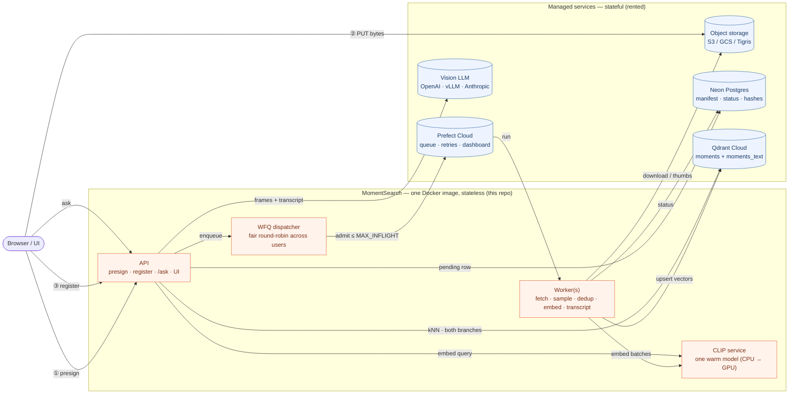
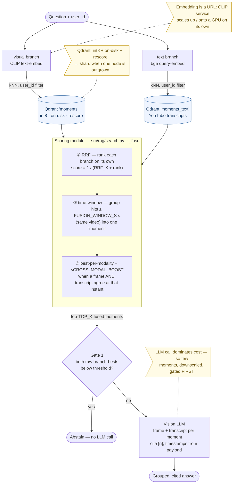

# MomentSearch

**Ask questions about your videos and get answers grounded in the exact moments — by what's _seen_ on screen, and (for YouTube) what's _said_ in the transcript.**

🌐 **Live app:** [momentsearch.fly.dev](https://momentsearch.fly.dev/get-started)

MomentSearch is an open-source, production-shaped stack for **visual** video
search and RAG. Users upload videos (or paste YouTube URLs); background workers
sample keyframes, dedup them, embed them and index them per-user in
[Qdrant](https://qdrant.tech). Ask a question and it retrieves the most
relevant moments and (optionally) has **your own vision LLM** read those
frames and write a cited answer — or honestly abstain when the evidence isn't
there. Every model in that sentence is **pluggable by name** — the answer LLM
and *both* embedding branches — so you can run it fully local and keyless, fully
hosted, or any mix.

> **Visual-first, multimodal for YouTube.** The core is *visual* — CLIP over
> sampled frames, so it works on silent footage, screen recordings, sports,
> b-roll, slides, demos: anything you can *see*. For **YouTube** it adds a
> **transcript** branch (captions) and fuses the two, so "find where they *talk
> about* X" works too. **Uploaded files are visual-only for now** — no audio
> transcription yet (that'd need Whisper).

- 🎥 **Presigned uploads** — the browser PUTs straight to object storage; gigabytes never flow through the API
- ⚙️ **Queue + stateless workers** — the API answers `202` instantly; Prefect-orchestrated workers do the heavy lifting
- 🔍 **Visual retrieval** — CLIP embeddings, runs locally, no API key needed to search
- 👥 **Multi-tenant & private** — every bucket key, Postgres row and Qdrant point is `user_id`-tagged and filtered
- 🛡️ **Confidence gate** — below-threshold retrievals abstain *before* the LLM is ever called
- 💬 **Cited answers** — bring your own vision LLM: **Gemini, OpenAI, Claude, Grok, OpenRouter, Groq, Together, Mistral, NVIDIA, Azure, Ollama/vLLM** — a provider name plus a key is the whole configuration ([Pluggable models](#pluggable-models-llms-and-embeddings))
- 🔌 **Swappable embeddings, both modalities** — frames via local **CLIP** (default, free) or hosted **Jina CLIP v2 / Cohere Embed v4 / Voyage multimodal / Gemini**; transcripts via **bge** (default) or **OpenAI / Gemini / Cohere / Voyage / Jina**. Mix them — the branches fuse by rank, not score
- 🩺 **`python -m src.providers`** — one command tells you what your `.env` resolved to, which key it used, and what's missing
- 🏠 **Per-user models** — each tenant can plug in a model *they* host (vLLM, Ollama, any OpenAI-compatible endpoint) and their answers run on it
- 🧩 **Multimodal fusion** — for YouTube, a transcript branch runs alongside the visual one and a **rank-based scoring module** (RRF + time-windows + cross-modal boost) fuses them; "find where they *talk about* X" works even when the screen doesn't show it
- 🔓 **Apache 2.0**

## Architecture

The design rule: **stateful = rented managed service, stateless = this repo's
code.** Every API box and
worker is disposable; durable state lives in object storage, Qdrant and
Postgres — "nothing on local."

Two paths that scale in opposite directions and never share a request — the
**write path** (slow, background: the API answers `202` instantly and workers do
the work) and the **read path** (fast: retrieval is ~ms, the LLM call dominates
cost):



The **write path** flows ①→③ then dispatcher → worker → (object storage +
CLIP + Qdrant + Postgres). The **read path** is a single `ask` that fans out to
the CLIP service and both Qdrant collections, then to the vision LLM. The
retrieval + scoring detail of that read path is the [RAG at scale](#rag-at-scale)
diagram below.

The whole system is **one Docker image** with four entrypoints (the command
picks which): the API, the ingest worker, the CLIP service, and a one-shot
seed gate. All application code lives under [`src/`](src/); the repo root holds
only build/config files.

| Piece | Where it lives | You… |
|---|---|---|
| API + worker + CLIP service (this repo, one image) | Fly.io / Docker / bare python | deploy it |
| Raw videos + thumbnails | S3 / GCS / Tigris (or local disk in dev) | rent it |
| Postgres — manifest + status | [Neon](https://neon.tech) | rent it |
| Work queue + run dashboard | [Prefect Cloud](https://app.prefect.cloud) (free tier) | rent it |
| Vector index | [Qdrant Cloud](https://cloud.qdrant.io) (or the compose container) | rent it |
| Vision LLM | OpenAI / NVIDIA / Anthropic / any OpenAI-compatible — env-switched | rent it |

## Quickstart (Docker)

```bash
git clone https://github.com/traversaal-ai/momentsearch.git
cd momentsearch
cp .env.example .env    # fill in: DATABASE_URL, PREFECT_API_URL/KEY
                        # (storage=local + compose Qdrant work out of the box;
                        #  LLM key optional — search works without it;
                        #  ADMIN_TOKEN optional — set it on public deploys)
docker compose up --build
# API + UI:       http://localhost:8000
# Queue/run view: https://app.prefect.cloud → Runs
```

Two pages, one app:

| Page | What it is |
|---|---|
| **`/`** | **Sample project — "A Deep Dive into LLMs."** Four LLM talks, pre-indexed, read-only. |
| **`/get-started`** | **Bring your own videos.** Add a YouTube URL or upload a file, then ask. |

**The sample corpus is a startup gate.** A one-shot `seed` service indexes the
four talks and must finish before `api`/`worker` start — so when
`http://localhost:8000` first answers, the samples are already queryable, never
half-done. First run takes a few minutes (model download + 4 videos); watch it
with `docker compose logs -f seed`. It's durable (Qdrant Cloud) and idempotent,
so every later `up` finds them indexed and starts in seconds. Set
`SEED_SAMPLE_VIDEOS=false` to skip the gate; `python examples/quickstart.py`
is the manual route (also runs sample queries in the terminal).

> The gate is wired into `docker compose up` (via `depends_on`) and Fly (via
> `release_command`) — use one of those. A bare `docker run` of the image only
> starts uvicorn and **skips seeding**, so the samples won't be indexed.

Bare processes instead of compose (each is `python -m` / uvicorn on the `src.`
module — run in separate terminals):
```
uvicorn src.app:app --port 8000          # API + UI
python -m src.worker                      # ingest worker
uvicorn src.clip_service:app --port 8001  # CLIP service (optional; else set CLIP_SERVICE_URL empty)
python -m src.seed                        # one-shot: index the 4 samples
```

## The write path — upload to searchable vectors

1. **Presign** — `POST /api/videos/presign {filename, content_type, size}`
   (Bearer auth when `ADMIN_TOKEN` is set). The server picks the key (`uploads/{user}/{id}.mp4` — never
   trusted from the client), caps size and type, and returns a time-limited
   PUT URL. With `STORAGE_PROVIDER=local` it returns a direct-upload URL
   instead (dev fallback).
2. **Upload** — the browser PUTs the file straight to the bucket.
3. **Register** — `POST /api/videos {video_id, key}`. The API HEAD-verifies
   the object (exists, size, key prefix belongs to this user), writes a
   `pending` row, schedules a Prefect run, returns `202` instantly.
4. **Worker** (per video, `WORKER_CONCURRENCY` at a time):
   - **fetch** — stream from the bucket (or yt-dlp for YouTube), `sha256` it;
     a duplicate `(user_id, source_hash)` marks the row `skipped` and stops.
   - **sample** — one ffmpeg pass decodes, samples (interval or scene-cut),
     downscales and pipes JPEGs to memory — no write-then-reopen. *The
     biggest scaling lever: sampling is what stops thousands of videos
     becoming billions of near-identical vectors.*
   - **dedup** — perceptual hash (dHash + luminance) drops visually-identical
     neighbours **before** they cost CLIP compute; thumbnails batch-upload to
     `frames/{user}/{id}/NNNNNN.jpg`.
   - **embed + index** — batches of `CLIP_BATCH` frames go to the **warm CLIP
     service** (no per-video model load), then upsert to the visual collection
     (`moments`) with deterministic IDs (`uuid5(video_id:frame_idx)` — re-runs
     overwrite, never duplicate), tagged `user_id`, `video_id`, `ms`,
     `modality:frame`, `t_start`/`t_end`, `embed_version`.
   - **transcript (YouTube only)** — captions → ~20s time-chunks → bge text
     embeddings → the text collection (`moments_text`), tagged `modality:text`
     with the same timestamps. **Best-effort:** uploads have no captions and some
     videos have none — either way the video stays visual-only and the run never
     fails. Runs *after* embed+index (whose delete clears both collections first).

Poll `GET /api/videos` (or watch the UI chips) until `indexed`.

## The read path — question to answer-or-abstain

`POST /api/ask {question, video_id?}`:

1. **Retrieve — both branches, in parallel, always** (no query router; routing
   fails exactly on the ambiguous questions where you need help most):
   - **visual** — text-embedding into the *frame* space → Qdrant `moments`,
     filtered by `user_id` (private *and* fast: the tenant index means a search
     touches only that user's slice), quantization-rescored. Milliseconds. The
     embedder is **provider-switchable** (`IMAGE_EMBED_PROVIDER`): local **CLIP**
     by default (free, offline, no key), or hosted **Jina CLIP v2** / **Cohere
     Embed v4** / **Voyage multimodal** / **Gemini** — see
     [Pluggable models](#pluggable-models-llms-and-embeddings).
   - **text** — text query-embedding → Qdrant `moments_text` (YouTube
     transcripts). Also provider-switchable (`TEXT_EMBED_PROVIDER`): **bge** via
     fastembed by default (CPU, free, no key — search stays keyless), or
     **OpenAI** / **Gemini** / **Cohere** / **Voyage** / **Jina** when you have a
     key. Skipped cleanly when `ENABLE_TRANSCRIPT=false` or nothing is indexed yet.
2. **Score — the fusion module** (`_fuse`, [src/rag/search.py](src/rag/search.py)).
   The two branches' raw scores are incomparable (CLIP ~0.3 vs bge ~0.7), so we
   never sort by raw score:
   - **RRF** — rank each branch on its own, score by rank `1/(RRF_K + rank)`, so
     a strong frame and a strong transcript hit compete fairly.
   - **time-window** — bucket hits within `FUSION_WINDOW_S` seconds (same video)
     into one *moment* and sum their RRF — the timestamp is the join key.
   - **cross-modal boost** — a moment where **both** a frame and a transcript
     chunk land at the same instant is ×`CROSS_MODAL_BOOST`: two independent
     modalities agreeing is the strongest relevance signal available.
   The top `TOP_K` fused moments go forward.
3. **Gate 1 — confidence** on the *raw per-branch bests* (RRF scores are far too
   small to threshold on): abstain only when **neither** what's on screen
   (`CONFIDENCE_THRESHOLD`) **nor** what's said (`TEXT_CONFIDENCE_THRESHOLD`)
   clears its bar — "I couldn't find that in your videos", **no LLM call**. Kills
   most hallucination risk for free.
4. **Generate** — each moment's frame (downscaled to `LLM_IMAGE_MAX_PX`) **and**
   its transcript excerpt go to the vision LLM: answer only from these moments,
   cite `[n]`, or say so. Citations are validated; invented references stripped.
5. **Answer** — clickable thumbnails + timestamps (presigned GETs straight from
   the bucket). Every timestamp is read from the winning hit's payload — the LLM
   never invents one — or the honest refusal.

The cost fact that drives this shape: retrieval is ~10-30ms; the multimodal
LLM call is seconds and dominates cost. Optimize there — few moments,
downscaled, gated — not the vector store.

## Pluggable models (LLMs and embeddings)

Every model MomentSearch talks to is a **provider name plus a key**. The
provider table ([src/providers/registry.py](src/providers/registry.py)) supplies
the endpoint, a default model and the vector dimension, so this is a complete
configuration:

```bash
LLM_PROVIDER=gemini
GEMINI_API_KEY=...
```

```
src/providers/
  registry.py     the table: endpoints, default models, dims, key env vars
  status.py       what's configured / what's installed  (GET /api/providers)
  llm/            answer synthesis — one module per wire dialect
  embed/          retrieval — one module per provider, both branches
```

**Answer model** (`LLM_PROVIDER`) — must be **vision-capable**; it is shown the
actual frames:

| provider | key env var | default model | notes |
|---|---|---|---|
| `openai` | `OPENAI_API_KEY` | `gpt-4o-mini` | also the generic OpenAI-compatible client |
| `gemini` | `GEMINI_API_KEY` | `gemini-3.6-flash` | native SDK (`pip install google-genai`) |
| `gemini_openai` | `GEMINI_API_KEY` | `gemini-3.6-flash` | same models, no extra dependency |
| `anthropic` | `ANTHROPIC_API_KEY` | `claude-sonnet-5` | `pip install anthropic` |
| `openrouter` | `OPENROUTER_API_KEY` | `openai/gpt-4o-mini` | one key, hundreds of models |
| `xai` (`grok`) | `XAI_API_KEY` | `grok-4.5` | |
| `groq` | `GROQ_API_KEY` | — set `LLM_MODEL` | catalogue rotates; no safe default |
| `together` | `TOGETHER_API_KEY` | `Qwen/Qwen2.5-VL-72B-Instruct` | |
| `fireworks` | `FIREWORKS_API_KEY` | — set `LLM_MODEL` | |
| `mistral` | `MISTRAL_API_KEY` | `pixtral-12b-2409` | |
| `nvidia` | `NVIDIA_API_KEY` | `meta/llama-3.2-11b-vision-instruct` | NIM |
| `azure_openai` | `AZURE_OPENAI_API_KEY` | — deployment name | `AZURE_OPENAI_ENDPOINT` |
| `ollama` / `lmstudio` / `vllm` | none | `qwen2.5vl` / — / — | localhost, no key |
| `custom` | optional | — | any OpenAI-compatible server via `LLM_BASE_URL` |

Most of these share **one** adapter, because most of the industry speaks the
OpenAI Chat Completions dialect — they differ only by `base_url`. Adding a
provider that speaks a known dialect is a row in a table, not new code. Unknown
names fall back to the generic OpenAI-compatible client, so a provider that
launched last week works today with `LLM_BASE_URL` alone.

**Embeddings** — two independent branches, each provider-switchable. They fuse
by *rank* (RRF), never by score, so mixing is fine: local CLIP frames plus hosted
Gemini transcripts is a sensible setup.

**Visual branch** (`IMAGE_EMBED_PROVIDER`) — frames *and* the question, one space:

| provider | default model | dim (truncatable to) | key env var | install |
|---|---|---|---|---|
| `clip` **default** | `clip-ViT-B-32` | 512 | none — offline | sentence-transformers |
| `jina` | `jina-clip-v2` | 1024 (64–1024) | `JINA_API_KEY` | **nothing** |
| `cohere` | `embed-v4.0` | 1536 (256–1536) | `COHERE_API_KEY` | **nothing** |
| `voyage` | `voyage-multimodal-3.5` | 1024 (256–2048) | `VOYAGE_API_KEY` | **nothing** |
| `gemini` | `gemini-embedding-2` | 1536 (128–3072) | `GEMINI_API_KEY` | `google-genai` |

**Transcript branch** (`TEXT_EMBED_PROVIDER`) — caption chunks:

| provider | default model | dim | key env var | install |
|---|---|---|---|---|
| `fastembed` **default** | `BAAI/bge-small-en-v1.5` | 384 | none — offline | fastembed |
| `openai` | `text-embedding-3-small` | 1536 | `OPENAI_API_KEY` (falls back to `LLM_API_KEY`) | `openai` |
| `gemini` | `gemini-embedding-2` | 1536 | `GEMINI_API_KEY` | `google-genai` |
| `cohere` | `embed-v4.0` | 1536 | `COHERE_API_KEY` | **nothing** |
| `voyage` | `voyage-3.5` | 1024 | `VOYAGE_API_KEY` | **nothing** |
| `jina` | `jina-embeddings-v3` | 1024 | `JINA_API_KEY` | **nothing** |

Per-branch overrides, when the defaults aren't what you want:
`IMAGE_EMBED_MODEL` / `IMAGE_EMBED_DIM` / `IMAGE_EMBED_API_KEY` /
`IMAGE_EMBED_BASE_URL` / `IMAGE_EMBED_BATCH` / `IMAGE_EMBED_CONCURRENCY`, and the
same six with a `TEXT_EMBED_` prefix. `*_BASE_URL` is how you point the `openai`
text embedder at your own vLLM/TEI server; `*_DIM` is required for a model the
registry's table doesn't list. The legacy `CLIP_MODEL` / `CLIP_DIM` /
`CLIP_BATCH` / `CLIP_SERVICE_URL` names still work as aliases
(`EMBED_SERVICE_URL` is the current name for the last one).

The visual branch needs a **joint** image+text space — search is text→image, so
the model must embed both into the *same* space. That's why OpenAI isn't an
option there (it has no image-embedding model) while CLIP, Jina CLIP v2, Cohere
Embed v4, Voyage multimodal and `gemini-embedding-2` are. Jina, Cohere and Voyage
need **no SDK at all** — those adapters are plain HTTPS from the standard library.

**Cost note for the visual branch:** a video is hundreds of frames, so per-frame
price and latency multiply fast. Local CLIP is free and the default for a reason.
Among the hosted ones, Jina/Cohere/Voyage take **many images per request**;
Gemini's embeddings endpoint takes **one image per call** (measured ~9s each, and
it appears to serialize per key), so `IMAGE_EMBED_PROVIDER=gemini` is best kept
for small corpora or paired with a higher `FRAME_INTERVAL_SEC` / lower
`MAX_FRAMES`. Tune the fan-out with `IMAGE_EMBED_CONCURRENCY`. The transcript
branch is cheap everywhere — a video is a few dozen chunks, not hundreds of frames.

**Two things that will bite you, and what the code does about them:**

- **Dimensions must match between indexing and querying.** Switching provider or
  model changes the vector size, which makes the existing index unusable. Qdrant
  collection creation now **refuses** to reuse a collection whose vector size
  disagrees with the configured embedder, with a message telling you to re-index
  or restore the old setting — rather than failing mid-ingest, or (worse) silently
  comparing vectors from two unrelated spaces.
- **Confidence thresholds are model-specific.** `CONFIDENCE_THRESHOLD=0.2` is
  calibrated for CLIP's text→image cosines (~0.2-0.35); a different embedder on
  another scale would over-abstain. Defaults now come from the chosen provider's
  preset, and providers we haven't calibrated default to **0 = gate off** — the
  safe direction. Measure yours with [benchmark/score.py](benchmark/score.py)
  before pinning a value.

**Check what your `.env` actually resolved to** — this is the first thing to run
when a key "isn't working":

```bash
python -m src.providers          # resolved config, missing keys, installed SDKs
python -m src.providers --live   # actually call every configured model
python -m src.providers --json   # same data as GET /api/providers
```

It names the env var each key came from, flags a provider name it doesn't
recognize (a typo resolves to a *fallback* rather than failing, which is
convenient and silent), and flags the single most confusing misconfiguration: a
leftover generic `LLM_API_KEY` from another provider shadowing the
provider-specific one.

## Bring your own model (per user)

Which model writes the answer is resolved **per tenant**, in this order:

1. **The user's own model** — saved via `PUT /api/llm` (**backend-only — not
   exposed in the UI**): any provider from the table above with their own key, or
   their own **vLLM** / Ollama / LM Studio endpoint via `base_url`. The model must
   be **vision-capable** — it is shown the actual frames (e.g.
   `Qwen/Qwen2.5-VL-7B-Instruct` on vLLM). `GET /api/providers` lists the choices;
   the UI only shows a read-only badge of which model is active — there's no
   model-settings form. Only the *LLM* is per-tenant: embeddings live in shared
   collections, so their dimension can't vary by user.
2. **The server default** — the `LLM_*` env config, used when the user hasn't
   attached one.
3. **No model** — retrieval still works; answers degrade to honest
   visual-similarity summaries.

```bash
# what can I attach?
curl localhost:8000/api/providers

# attach your own hosted vLLM
# (drop the Authorization header when ADMIN_TOKEN is unset — the dev default)
curl -X PUT localhost:8000/api/llm \
  -H "Authorization: Bearer $ADMIN_TOKEN" -H "Content-Type: application/json" \
  -d '{"provider":"openai","model":"Qwen/Qwen2.5-VL-7B-Instruct",
       "base_url":"http://my-vllm-host:8000/v1"}'

# or a hosted provider — model is optional, the preset knows its default
curl -X PUT localhost:8000/api/llm \
  -H "Authorization: Bearer $ADMIN_TOKEN" -H "Content-Type: application/json" \
  -d '{"provider":"grok","api_key":"xai-..."}'

curl -X POST -H "Authorization: Bearer $ADMIN_TOKEN" localhost:8000/api/llm/test
#  -> sends one tiny image through your model; fails fast if it isn't vision-capable

curl -X DELETE -H "Authorization: Bearer $ADMIN_TOKEN" localhost:8000/api/llm
#  -> back to the server default
```

Settings live in Postgres (`ms_user_llms`, one row per user); API keys are
write-only (masked on read, blank on update keeps the stored key). Bad configs
are rejected at `PUT` time with the fix named ("no API key. Set XAI_API_KEY"),
not at answer time. `/api/ask`
responses include `llm_source: "user" | "server"` so the UI can show whose
model answered. **Ops note:** user `base_url`s make your API box call
user-chosen hosts — on a hosted deployment, egress-restrict the API container
or allowlist hosts; self-hosted single-tenant setups don't care.

## Qdrant at frame scale

One shared collection, multi-tenant by `user_id` (tenant payload index) — not
collection-per-user. Frames balloon vector counts fast (a 1h video at 2s
sampling ≈ 1,800 candidate frames), so the low-RAM profile defaults **on**:

| Flag | Effect | Default |
|---|---|---|
| `QDRANT_ON_DISK` | original float vectors on disk | on |
| `QDRANT_QUANTIZATION` | int8 copies pinned in RAM (~4× smaller) do the search; queries rescore from the originals | on |
| `QDRANT_HNSW_ON_DISK` | the HNSW graph on disk too | on |

For scale intuition: 200M frame vectors ≈ 600GB float32 vs ≈ 150GB int8.
On a big-RAM node flip these off to trade memory back for speed. Payloads are
trimmed to filter/display fields; titles/URLs live in Postgres and join at
answer time. `embed_version` on every point means a future CLIP upgrade can
re-embed in the background without breaking the live index.

## RAG at scale

The read path in detail — one `ask` fans out to **both** retrieval branches,
they're fused by a rank-based scoring module, gated for confidence, then (only
if it clears the gate) synthesized by a vision LLM. The dashed notes mark where
each stage **scales** as the corpus and traffic grow:



Why this shape holds up as the corpus grows: **retrieval is milliseconds and the
multimodal LLM call is seconds**, so the funnel spends its cheap budget widely
(both branches, always) and its expensive budget narrowly (a handful of gated,
downscaled moments). Each box below scales on its own bottleneck, independently —
that's the whole point of splitting the four processes out:

| Component | Scales by | Because its bottleneck is… | How |
|---|---|---|---|

| Component | Scales by | Because its bottleneck is… | How |
|---|---|---|---|
| **API** (`src/app.py`) | replicas (horizontal) | request concurrency (all I/O, no heavy compute) | stateless; auto-stops when idle on Fly |
| **Worker** (`src/worker.py`) | replicas (horizontal) | ingest throughput — download + ffmpeg per video | `fly scale count worker=N` / `--scale worker=N`; workers only dial out, zero coordination |
| **Embedding service** (`src/clip_service.py`) | vertically → **GPU** | embedding FLOPs (the compute-heavy step) | one warm model behind `EMBED_SERVICE_URL` (`CLIP_SERVICE_URL` still works); move it to a GPU box, change only the URL. Skipped entirely when the embedder is a hosted API — nothing to warm |
| **Qdrant** | memory profile → shards | vector count (frames balloon fast) | int8 + on-disk + rescore by default; shard when one node is outgrown |

The two axes that matter pull in opposite directions: **ingest** (many cheap
CPU workers, scale out) vs. **embedding** (one hot model, scale up/GPU). Coupling
them — the naive "CLIP inside the worker" — would force you to pay for GPUs on
every worker or starve embedding on every scale-out. Splitting them is what lets
you add cheap workers for a backfill while a single GPU handles all their embeds.

## Scaling — the details

**Workers.** The API must answer `202` instantly, but a video takes minutes —
workers pull runs from Prefect Cloud and execute them, `WORKER_CONCURRENCY`
at a time. Runs bottleneck on different resources (fetch = network, sampling
= CPU, embedding = CPU/GPU), so concurrent runs overlap. One worker machine
full? `fly scale count worker=3` or `docker compose up --scale worker=3` —
workers only dial out, so replicas need zero coordination.

**Embedding (the usual bottleneck) — "embedding is a URL".** Local inference runs
in a dedicated service ([clip_service.py](src/clip_service.py)): one warm model
loaded once at boot, api + workers send batches over HTTP (`EMBED_SERVICE_URL`;
`CLIP_SERVICE_URL` is still accepted). That's what makes workers cheap and
stateless — no torch, no ~15-30s model reload per video — and it's the standard
model-serving pattern (TEI / Triton / OpenAI-embeddings-shaped). Scaling
embedding = scaling that one service: CPU container today, the same container on
a GPU machine later, with nothing but the URL changing. Unset the URL and
everything embeds in-process — the zero-service simple mode for cloners.

Choosing a **hosted** embedder ([Pluggable models](#pluggable-models-llms-and-embeddings))
is the third option: it sidesteps this service entirely — the API and workers call
the provider directly, so there's nothing to warm, nothing to scale, and the
service URL is ignored. You've swapped a compute-scaling problem for a
cost-per-frame one.

**Deletes purge everything** — `DELETE /api/videos/{id}` removes the vectors
(by filter), thumbnails + raw upload (batch delete), and the manifest row.

**Fair scheduling (WFQ).** The queue is fair, not FIFO. If it enqueued every
video to Prefect at register time, Prefect would run them in submitted order —
one user who uploads 50 videos blocks everyone behind them. Instead videos wait
`pending` in Postgres and a **dispatcher** ([src/dispatcher.py](src/dispatcher.py))
admits them **round-robin across users**, keeping only `DISPATCH_MAX_INFLIGHT`
running at once. So the waiting line lives in *our* DB, fairly ordered
([`db.wfq_claim`](src/db.py) ranks each user's videos by age and takes
everyone's oldest first, then everyone's second, …) — no user can starve the
others. Set `ENABLE_FAIR_DISPATCH=false` to fall back to plain FIFO and see the
difference. `DISPATCH_MAX_INFLIGHT` should equal your real capacity
(`worker machines × WORKER_CONCURRENCY`); anything above that would just pile up
FIFO inside Prefect and defeat the fairness.

```
FIFO:  user A ▓▓▓▓▓▓▓▓▓▓ (50)  then→  user B ▓   ← B waits for all of A
WFQ:   A▓ B▓ A▓ B▓ A▓ B▓ …            ← interleaved; B is served immediately
```

**Later, under real load** (design room exists, not built): per-tenant *quotas*
and weights (the dispatcher's round-robin extends to weighted shares),
backpressure on queue depth, Redis query cache, a cross-encoder reranker over
the fused moments, and OCR / on-screen-text as a third branch (transcript hybrid
search already ships — see the read path above).

## Deploy (Fly.io)

Full step-by-step guide: **[DEPLOYMENT.md](DEPLOYMENT.md)**. The short version —
one image, **three process groups** from [fly.toml](fly.toml) — `api`, `worker`,
and `clip` (each on its own machine size, each scaled by its own bottleneck; the
"what's scaled and why" table above explains the split):

```powershell
fly launch --no-deploy --copy-config          # create the app (once)
fly storage create                            # Tigris bucket; injects AWS_* secrets
Get-Content .env | Where-Object { $_ -match '^[A-Z_]+=.+' -and $_ -notmatch '^FLY_' } | fly secrets import
fly secrets set STORAGE_PROVIDER=flyio
fly deploy --ha=false                         # build image, start api/worker/clip
fly scale count worker=2                      # more ingest throughput, anytime
```

On every deploy, fly.toml's `release_command` runs the **seed gate** first
(`python -m src.seed`); if the four samples can't be indexed the deploy aborts
and the previous version keeps serving. The API machine auto-stops when idle;
worker + clip stay up (scale both to 0 between ingest sessions — queued runs
just wait). Set a CORS rule on the bucket for your site's origin (see
`.env.example`) or browser uploads fail. Need GPU-speed embedding later? Run
the same clip container on a GPU machine and point `CLIP_SERVICE_URL` at it —
nothing else changes.

### Continuous deployment (GitHub Actions)

[`.github/workflows/fly-deploy.yml`](.github/workflows/fly-deploy.yml) deploys
to Fly on every push to `dev`. One-time setup — create a deploy token and add
it as the `FLY_API_TOKEN` repo secret (Settings → Secrets and variables →
Actions):

```bash
fly tokens create deploy -x 999999h
```

## API

Auth is **optional**: with `ADMIN_TOKEN` unset (the local-dev default) no
endpoint needs a header — drop the `Authorization` lines below. Set it on any
public deploy and mutating endpoints start requiring it. The tenant is the
`X-User-Id` header (default `default`); swap in real per-user auth later —
the data model is already tenant-scoped everywhere.

```bash
# 1) presign
curl -X POST localhost:8000/api/videos/presign \
  -H "Authorization: Bearer $ADMIN_TOKEN" -H "Content-Type: application/json" \
  -d '{"filename":"demo.mp4","content_type":"video/mp4","size":123456789}'
# 2) PUT the file to the returned url, then 3) register:
curl -X POST localhost:8000/api/videos \
  -H "Authorization: Bearer $ADMIN_TOKEN" -H "Content-Type: application/json" \
  -d '{"video_id":"up_ab12cd34ef","key":"uploads/default/up_ab12cd34ef.mp4","title":"Demo"}'

# YouTube instead:
curl -X POST localhost:8000/api/videos \
  -H "Authorization: Bearer $ADMIN_TOKEN" -H "Content-Type: application/json" \
  -d '{"url":"https://youtu.be/VIDEO_ID"}'

# status / retry / delete
curl localhost:8000/api/videos
curl -X POST -H "Authorization: Bearer $ADMIN_TOKEN" localhost:8000/api/videos/up_ab12cd34ef/retry
curl -X DELETE -H "Authorization: Bearer $ADMIN_TOKEN" localhost:8000/api/videos/up_ab12cd34ef

# ask
curl -X POST localhost:8000/api/ask -H "Content-Type: application/json" \
  -d '{"question":"a diagram of the attention mechanism"}'

# which model providers are supported, and what is this deployment using?
curl localhost:8000/api/providers
```

Public: `GET /` (sample UI) · `GET /get-started` · `GET /api/config` ·
`GET /api/providers` · `GET /api/health`.

## Layout

Repo root holds only build/config/docs; **all Python lives under `src/`**, with
the four entrypoints as top-level modules in the package.

```
├── Dockerfile               one image, four entrypoints (command selects which)
├── docker-compose.yml       local dev: clip + seed gate + api + worker
├── fly.toml                 Fly.io: api/worker/clip process groups + seed release_command
├── requirements.txt
├── .env.example             every env knob, documented inline
├── .github/
│   └── workflows/
│       └── fly-deploy.yml   CI: deploy to Fly on push to dev
├── ui/
│   └── index.html           single-file web UI (presigned upload, status poll, player)
├── examples/
│   └── quickstart.py        manual in-process seed + terminal query demo
└── src/                     ── entrypoints ──────────────────────────────────
    ├── app.py               unified FastAPI app — videos + search routers, one port
    ├── worker.py            Prefect worker — serves "ms-ingest-video/ingest"
    ├── clip_service.py      embedding service — warm local models behind a URL
    ├── seed.py              startup gate — indexes the 4 samples, then exits
    │                        ── core ──────────────────────────────────────────
    ├── config.py            every env knob in one place
    ├── db.py                Neon Postgres: manifest + status + per-user LLM rows
    ├── jobs.py              Prefect Cloud trigger (API-side run_deployment)
    ├── storage.py           object storage (aws|gcp|gcp_native|flyio|local)
    │                        + presigned PUT/GET, HEAD verify, batch delete
    ├── llm.py               back-compat shim -> providers/llm/
    ├── samples.py           the four-sample "Deep Dive into LLMs" corpus
    ├── seeding.py           blocking seed-to-completion logic (used by seed.py)
    ├── providers/           ── pluggable models (see "Pluggable models") ─────
    │   ├── registry.py      the provider table: endpoints, models, dims, keys
    │   ├── status.py        configured/installed/missing — GET /api/providers
    │   ├── __main__.py      `python -m src.providers` model doctor (+ --live)
    │   ├── llm/             answer synthesis, one module per wire dialect
    │   │   ├── base.py          LLMConfig, system prompt, image downscaling
    │   │   ├── openai_compat.py OpenAI dialect: OpenAI, OpenRouter, Grok, Groq,
    │   │   │                    Together, Fireworks, Mistral, NVIDIA, Azure,
    │   │   │                    Ollama, LM Studio, vLLM, custom
    │   │   ├── gemini.py        Google Gemini, native google-genai SDK
    │   │   └── anthropic.py     Anthropic Messages API
    │   └── embed/           retrieval embeddings, both branches
    │       ├── base.py          config/dim resolution, HTTP, L2-normalizing
    │       ├── clip_local.py    local CLIP — joint image+text (default)
    │       ├── fastembed_text.py bge — transcripts (default)
    │       ├── openai_text.py   OpenAI + any OpenAI-compatible embeddings
    │       ├── gemini.py        gemini-embedding-2 — unified space, both branches
    │       ├── jina.py          jina-clip-v2 / v3 — both branches, no SDK
    │       ├── cohere.py        embed-v4.0 — both branches, no SDK
    │       ├── voyage.py        voyage-multimodal — both branches, no SDK
    │       └── remote.py        client for the warm embedding service
    ├── api/
    │   ├── videos.py        write path: presign, register, status, retry, delete
    │   └── search.py        read path: /api/ask, /api/llm, /api/providers, media, UI
    ├── dispatcher.py        WFQ: fair round-robin admission of pending videos
    ├── ingest/
    │   ├── fetch.py         source acquisition (bucket download | yt-dlp) + sha256
    │   ├── frames.py        ffmpeg pipe-to-memory sampling (interval | scene)
    │   ├── dedup.py         perceptual-hash dedup (before embedding spends compute)
    │   ├── transcript.py    YouTube captions → time-chunks (the text branch)
    │   └── pipeline.py      the Prefect flow: fetch → sample → embed/index → transcript
    └── rag/
        ├── embeddings.py    back-compat shim -> providers/embed/
        ├── vector_store.py  multi-tenant Qdrant: visual + text collections, int8/on-disk
        └── search.py        2-branch retrieve → RRF fusion/scoring → gate → cited answer
```

## Security notes (presigned uploads)

- On a public deploy, set `ADMIN_TOKEN` so the presign endpoint is authed —
  otherwise anyone can mint upload URLs. (Unset = open, fine for local dev.)
- The **server** generates the key (`uploads/{user}/{uuid}`), never the client;
  register re-checks the prefix, so users can't claim others' objects.
- Size and content-type are capped at presign time and re-verified via HEAD.
- Keep the bucket **private**; thumbnails/playback go out via presigned GETs.
- ffmpeg/yt-dlp parse untrusted input — run workers in containers, not on the
  API box.
- Prompt-injection: frames are pixels (low risk), but treat any future
  OCR/transcript text as data, never instructions.

## Known limits

- **YouTube downloads.** Modern yt-dlp (2025+) needs a **JavaScript runtime +
  its EJS challenge-solver** to extract YouTube formats at all — without them
  every video fails "This video is not available." The Docker image installs
  **Node** and the worker fetches the solver automatically, so this works out
  of the box; for bare-process dev, install `node` or `deno`. **Cookies** then
  get past sign-in/bot-checks and work **everywhere** (home and datacenter):
  export a `cookies.txt` from a logged-in browser and supply it via
  `YT_COOKIES_FILE` (mounted file, local) or `YT_COOKIES_B64` (base64 secret,
  e.g. `fly secrets set YT_COOKIES_B64="$(base64 -w0 data/cookies.txt)"` on
  cloud). Cookies expire in a few weeks — re-export when it starts failing.
  Uploads are never affected by any of this.
- The embedded local Qdrant (`QDRANT_URL` empty) can't be shared by API and
  worker concurrently — single-process dev only; compose runs a real Qdrant.
- Faithfulness ceiling is *near*-zero, not zero — the gate + citations remove
  most of it; a vision-verifier pass is a future, costlier layer.

## License

Apache 2.0.
